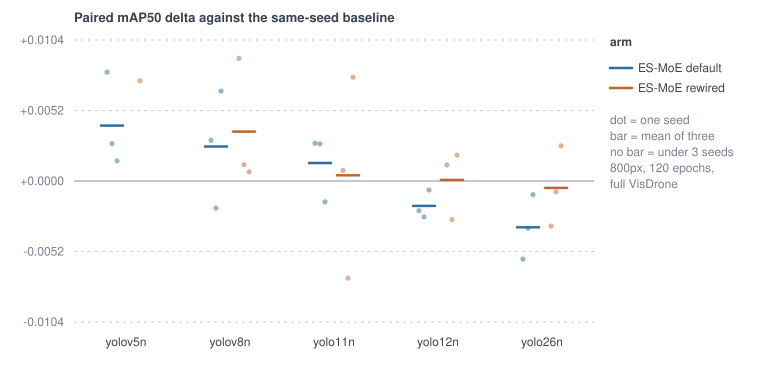
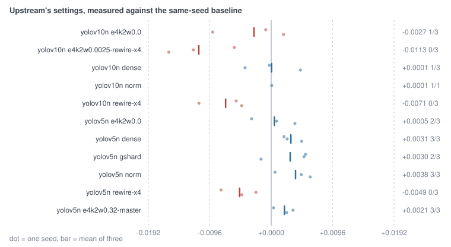

<h1 align="center">ES-MoE Toolkit</h1>

Drop-in expert-sparse MoE block for Ultralytics YOLO

---

 

  
  
  
  
  
  

  One call adds the block, the router loss reaches the optimiser, and every number here has a run record behind it.

---

Docs: [`English`](https://lfan-ke.github.io/ES-MoE/) · [`中文`](https://lfan-ke.github.io/ES-MoE/zh/) · Quick start in Colab: [`notebooks/quickstart.ipynb`](https://colab.research.google.com/github/Lfan-ke/ES-MoE/blob/main/notebooks/quickstart.ipynb) · Ask questions about the code: [`DeepWiki`](https://deepwiki.com/Lfan-ke/ES-MoE).

 

## Install

    pip install esmoe

The distribution, the import and the CLI are all `esmoe`; the project is written ES-MoE in prose.

Requires `ultralytics`.

## Use

One call covers register, graft, build and wire:

    import esmoe

    model = esmoe.equip("yolo11n.yaml", weight=0.01)
    model.train(data="coco8.yaml", epochs=10)

Or take the steps apart when you need control over each one:

    from ultralytics import YOLO
    import esmoe

    esmoe.inject_esmoe()                                    # make `ESMoE` resolvable in model.yaml
    esmoe.graft("yolov8n.yaml", out="v8-esmoe.yaml", at=[4, 6])  # insert blocks, renumber the head
    model = YOLO("v8-esmoe.yaml")
    esmoe.attach_aux_loss(model, weight=0.01)               # router loss joins the training loss

From the shell:

    esmoe graft yolo11n.yaml -o yolo11n-esmoe.yaml -e 4 -k 2 --at backbone_end

`attach_aux_loss` adds an `esmoe_aux` entry to the trainer's loss table, so a non-zero,
back-propagated auxiliary term shows up in `results.csv` rather than merely in a config.

Written by hand, a grafted config layer is just:

    [-1, 1, ESMoE, [4, 2]]                              # num_experts, top_k
    [-1, 1, ESMoE, [4, 2, null, {out_norm: true}]]      # ... and settings the trainer must keep

The block is channel preserving and infers its width on the first forward, which is what lets stock
`parse_model` size it without a patch. Settings belong in the config because the trainer rebuilds
the model from it, dropping anything set on the blocks beforehand.

## Extend

Experts and the balancing objective are plain callables, so a variant is a few lines:

    esmoe.ESMoE(num_experts=4, top_k=2, expert=MyExpert, balance=my_balance_fn)

`MyExpert(c1, c2, k) -> Module`, `my_balance_fn(probs, gate) -> scalar`. A custom objective lives on
the instance, so it cannot survive a trainer rebuilding the model from its config; the four that
ship (`switch`, `gshard`, `master`, `gshard_probs`) can be named there instead. `esmoe.blocks(model)`
walks every block in a model, `esmoe.collect_aux_loss(model)` returns the current step's router loss
for custom training loops, and `block.spec()` reports the settings a block is holding.

## Compatibility

| backbone | build + forward | grafted config | aux loss in training | protocol runs |
|:--:|:--:|:--:|:--:|:--:|
| YOLOv5 | yes | yes | yes | yes |
| YOLOv8 | yes | yes | yes | yes |
| YOLOv9 | yes | yes | yes | yes |
| YOLOv10 | yes | yes | yes | yes |
| YOLO11 | yes | yes | yes | yes |
| YOLO12 | yes | yes | yes | yes |
| YOLO26 | yes | yes | yes | yes |
| YOLO-Master (fork) | yes | yes | yes | no |

Verified by `tests/test_ultralytics.py` on ultralytics 8.4.101 and 8.4.132, which report loss items
in two different shapes; both are handled. The training column is backed by real 1-epoch VisDrone
runs on four generations (`results/*-compat-*.json`) and by the 120-epoch protocol runs on all seven,
each logging a non-zero `train/esmoe_aux`.

Graft and forward are exercised on every row in CI. The last column separates "the block builds and trains" from
"we ran the full budget-fair protocol on it"; only the YOLO-Master row is still the former alone. The YOLO-Master row runs against the fork's vendored ultralytics: `scripts/fork_smoke.py` grafts their `yolo-master-n.yaml`, trains one epoch with a non-zero `esmoe_aux`, and builds their own `ES_MOE` config alongside ours.

DDP works: `attach_aux_loss` routes `model.train()` through a trainer class that lives in `esmoe.trainer`, so the
worker processes ultralytics spawns register the block and the auxiliary loss before they build. Verified by
`scripts/verify.py` (the real worker file in a fresh interpreter; two gloo ranks with agreeing router gradients).
Not supported together with `compile=True`, which turns off `find_unused_parameters`.

## Selected default

`ESMoE(num_experts=4, top_k=2)` with `attach_aux_loss(weight=0.01)`, chosen under one budget over
2/4/8-expert and top-1 variants. Under the repository protocol (VisDrone, imgsz 800, 120 epochs, three seeds)
the matrix runs to seven backbone generations × three arms × three seeds and more, 113 runs. What separates a positive
cell from a negative one is what the backbone ends in, not how new it is: the default wiring is positive on the
SPPF family (+0.0055 v5n, +0.0025 v8n, +0.0025 v9t), sits on zero once the end is an attention block (−0.0002
v10n, +0.0013 11n), and is negative on area attention and the E2E head (−0.0018 12n, −0.0034 26n). The block
costs +10.4% parameters and about 9% more wall-clock per epoch.

Each dot is one seed, each bar the mean of three. The seeds routinely straddle zero even where the mean does
not, which is the honest reading of a three-seed protocol: an
[interactive version](https://lfan-ke.github.io/ES-MoE/charts/) carries the per-seed values and the second
metric. Where the damage lands depends
on the backbone: v8n loses large objects (APl −0.010, 0/3), 26n loses small ones (APs −0.0045, 0/3), 12n is
direction-unstable.

Further arms ask what upstream's own settings are worth. Two of them are internal to the block and both
help; upstream's layout of four blocks per backbone is negative on both metrics at 0/3 on both backbones it ran
on, and stays negative with each block's weight cut to a quarter so the auxiliary total matches one block —
the count is what costs, not the pressure.

How concentrated the dispatch is does not predict accuracy: r = +0.044 over the 81 runs that have both a routing
analysis and a paired delta. What the balancing term does secure is that no expert dies. Without it all six
checkpoints lose two of four experts; the Switch term at 0.01 leaves none dead in 66. The paper's objective and
upstream's read the gate, which is renormalised over the top-K and so has no gradient for an expert outside it:
five of six such checkpoints have a dead expert, even at more pressure than Switch.

The default graft leaves consumers that name the old backbone end by index — YOLOv8's P5 lateral among them —
reading the pre-block tensor; `graft(..., rewire=True)` retargets them. That arm is the only 3/3 one on v8n
(+0.0036) and pulls 12n and 26n back to near parity (+0.0001 and −0.0005); only on 11n does it trail the default.
Verdicts against the pre-registered lines: `docs/JUDGMENT.md`. Full tables: `docs/SELECTION.md`,
`results/buckets.md`, `results/routing.md`, `results/report.md`.

## Develop and reproduce

    uv sync --group dev
    uv run pytest -q
    uv run python scripts/capture_env.py                  # freeze environment into env/
    EPOCHS=20 FRACTION=0.25 SEEDS="0 1 2" bash scripts/sweep.sh
    uv run python scripts/report.py                       # results/summary.md

Every run writes one machine-readable record to `results/` (config, dataset, hardware, budget, seed,
metrics, artifact, status, limitation). Read `limitations.md` before quoting any number. The 112
protocol checkpoints live on the [`checkpoints`](https://github.com/Lfan-ke/ES-MoE/tree/checkpoints)
branch (Git LFS, orphan — `main` stays small), flat-named to match the run records.

## Linked projects

- [ultralytics](https://github.com/ultralytics/ultralytics) - the official YOLO framework this plugs into.
- [Tencent/YOLO-Master](https://github.com/Tencent/YOLO-Master) - where ES-MoE comes from ([paper](https://arxiv.org/abs/2512.23273)).

## License

AGPL-3.0-only, matching the Ultralytics ecosystem it builds on.
