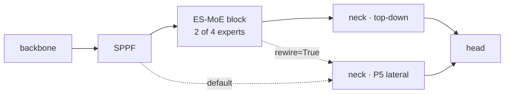
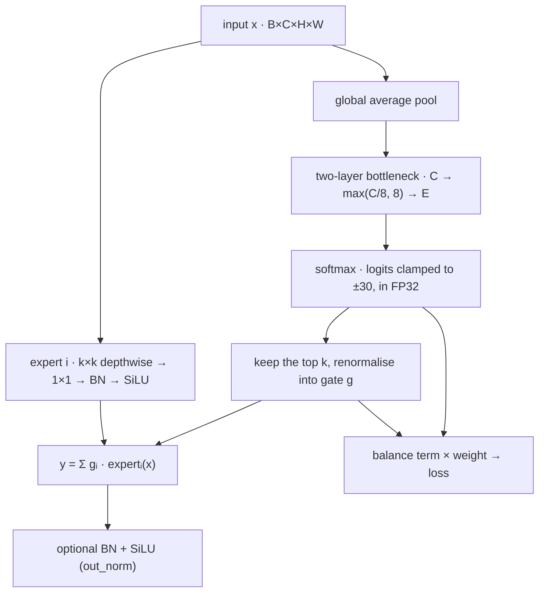

# ES-MoE and YOLO

Three things on this page: what an ES-MoE block adds to an ordinary YOLO, how the block computes in training and in inference, and how this package compares, item by item, with YOLO-Master's implementation and with the paper. Upstream code is YOLO-Master's fork at `acce839c`; the paper is [arXiv 2512.23273](https://arxiv.org/abs/2512.23273).

## Structure

Every layer of an ordinary YOLO has a fixed structure and fixed weights once trained, and every image goes through the same computation. An ES-MoE block puts several expert branches side by side at one position, and a small router picks k of them for each image; which ones it picks changes with the input.

<figure class="es-fig es-fig--diagram">
<figcaption>The block at the end of the backbone<em>default wiring and rewire differ only in the tensor the P5 lateral reads</em></figcaption>

</figure>

| item | ordinary YOLO | with an ES-MoE block |
|:--:|:--:|:--:|
| computation per image | fixed | the router picks k experts per image |
| kernels | fixed per layer | side-by-side experts with different kernels (3, 5, 7, 9) |
| training loss | box, cls, dfl | plus a balance term (the auxiliary loss) |
| parameters (YOLOv8n, 80 classes) | 3,157,200 | 3,471,732 |
| placement | — | one block at the end of the backbone by default; `at="backbone_stages"` puts one after every stage |

## Inside the block

<figure class="es-fig es-fig--diagram">
<figcaption>Forward pass of one block<em>router and experts run side by side; the output is the gated sum of the chosen experts</em></figcaption>

</figure>

The router picks per image, not per pixel or region. Each expert is a depthwise-separable convolution: the k×k depthwise convolution handles space and the 1×1 pointwise convolution mixes channels. The gate is non-zero only on the k chosen experts and renormalised to sum to one.

## Training and inference

| | training | validation and inference |
|:--:|:--:|:--:|
| which experts compute | only those chosen in the batch by default; with `dense_training=True` all of them, the unchosen multiplied by zero, as upstream does | only the chosen ones |
| pruning | none | when `dynamic_threshold` is above zero, `sparse_inference` is on and k is below the expert count, an expert whose renormalised share falls below the threshold is skipped too; the leader always stays |
| balance term | added to the loss and optimised | still computed and counted in the validation loss, never optimised |
| export | — | every expert enters a traced graph, so the exported model still routes per input |

Backpropagation returns through y = Σ gᵢ · expertᵢ(x) along two paths:

- **To the experts**: scaled by the gate gᵢ. An expert not chosen for an image has a zero gate there, and gets no gradient along this path.
- **To the router**: the detection loss shifts the share among the chosen experts through ∂L/∂gᵢ. Choosing is a discrete step with no gradient, and the renormalised gate depends only on the chosen logits, so an expert outside the top k gets nothing from the detection loss.

The balance term therefore has to read the full softmax probabilities for unchosen experts to receive a gradient. This package's default Switch form reads the probabilities; upstream's term and the paper's eq. 13 read the renormalised gate and give experts outside the top k zero gradient. All 6 checkpoints without a balance term have dead experts, and 5 of the 6 with a gate-reading term do; see [Experiments](experiments.md#routing-and-balancing).

## Against YOLO-Master

| item | YOLO-Master `ES_MOE` | esmoe `ESMoE` |
|:--:|:--:|:--:|
| installation | the ultralytics fork YOLO-Master maintains | `pip install esmoe`, on official ultralytics |
| backbones | the fork's own configs such as `yolo-master-n` | official YOLOv5n to YOLO26n, seven generations, plus `yolo-master-n` on the fork |
| adding it | write the model config by hand | `equip` registers, grafts, builds and wires the loss in one call; `graft` renumbers layer references; `esmoe graft` on the command line |
| placement | `yolo-master-n` puts one block after the C3k2 at P2 and P3 and after the A2C2f at P4 and P5 | one at the end of the backbone by default; `at="backbone_stages"` puts one after every downsampling stage, which on `yolo-master-n` matches upstream's positions |
| experts | depthwise-separable convolutions; kernels 3, 5, 7 for up to 3 experts, then up by 2 each | the same; `expert=` takes any callable |
| router | global pool + two 1×1 convolutions, hidden width `max(C/8, 8)`, logits clamped to ±30 | the same (linear layers, numerically equivalent) |
| gate | soft top-k in training and export, hard top-k in inference | the same, with tests showing the two equal |
| output normalisation | always BN + SiLU | `out_norm=True` |
| experts in training | all of them compute | `dense_training=True` |
| inference pruning | `dynamic_threshold=0.4`, the leader kept | the same rule, 0.0 (off) by default |
| balance term | GShard on the gate, coefficient 1.0; the trainer normalises it by a running mean, caps it at 3.0 and adds it to each of box, cls and dfl; the running mean is saved in checkpoints | four to choose from, Switch at weight 0.01 by default; `recipe="upstream"` reproduces the normalisation, cap, addition to all three terms, half learning rate for the router and three frozen-expert epochs; the running mean is not saved, so a resumed run starts it again |
| multi-GPU | expert usage is all-reduced across cards before squaring; `find_unused_parameters=True` | the balance term is computed per card; under DDP and `compile=True` an unrouted expert stays in the graph at zero weight |
| precision fallback | on a non-finite loss or gradient, mixed precision is turned off and the epoch replayed; on NaN a checkpoint is rolled back | the official trainer's behaviour, no fallback |
| other machinery | expert pruning before export; balance coefficient scheduled by Gini coefficient and mAP saturation; `set_top_k`, `enable_sparse_inference` | none of these; `configure` changes a block's settings where no trainer is involved |
| where settings live | constructor arguments | the model config line, so they survive the trainer's rebuild; `scripts/blockspec.py` reads them back from a checkpoint |
| custom balance terms | — | any `(probs, gate) -> scalar` function, stored in the config by qualified name |
| verification | — | tests rewrite upstream's and the paper's operators from source for a numerical comparison; ten real-training checks in `scripts/verify.py` |
| accuracy | the block adds mAP50 +0.0104 on the fork (FP32, 3/3) | the block adds +0.0095 on official ultralytics (FP32, 3/3); the gap between the two, +0.0009, is equivalent |

YOLO-Master's released `yolo-master-n` weights use 3 experts per block with all 3 active. Loaded into this package's blocks, they give the four COCO val2017 metrics the fork gives, equal to five decimals, with 2,694,364 parameters on both sides.

## Against the paper

The claims in the paper that the experiments here can test, next to what was measured. The conditions are on [Experiments](experiments.md#scope): VisDrone, nano-scale backbones, 120 epochs from scratch.

| paper | measured |
|:--:|:--:|
| soft top-k (eq. 8) in training, hard top-k (eq. 9) in inference | the two agree up to ε, verified by tests |
| the balance term (eq. 12, 13) prevents expert collapse | eq. 13 and upstream's gate-reading GShard differ by an affine map; a term that reads the gate gives experts outside the top k zero gradient, and 5 of 6 such checkpoints have dead experts; Switch at weight 0.01 has none in 66 |
| the router makes experts specialise by scale | 528 correlations over 132 block analyses run from −0.49 to +0.59, 283 positive and 245 negative; 76 of 96 multi-seed groups change sign across seeds; the leading expert's kernel takes all four values |
| simple regions activate fewer experts (§2.3) | the router pools the whole image, so regions of one image cannot pick different experts; eq. 7 and 8 fix k, so training always activates exactly k; only inference-time pruning with `dynamic_threshold` follows the input |
| the block goes into backbone and neck (§3.1) | the paper's Table 5 makes backbone-only the default (62.1, both places 54.9, no dataset named; 62.1 equals the VOC column of Table 1). That layout adds only 0.03M parameters, not the four blocks of upstream's config (+523,000); this package's default is also backbone-only, with one block |
| expert count and k (Tables 6, 7) | the paper picks 4 experts with top-2; this package's selection reached the same configuration under a different budget |
| loss setup (Table 8, Config 5) | the paper drops DFL and sets the balance coefficient to 1.5; upstream keeps DFL with coefficient 1.0 and normalisation; this package keeps DFL with weight 0.01 by default |
| an objective that encourages complementary experts (abstract) | the method section defines only eq. 13; upstream's `ES_MOE` does not use `MoELoss`, whose diversity term defaults to 0; neither side implements it |
| output normalisation (Norm in eq. 2) | +0.0038 on v5n (3/3); offered as the `out_norm` switch |
| training setup (§4.1) | the paper uses a YOLOv12-N baseline at 640 px, 600 epochs, batch 256; this repository trains from scratch on VisDrone for 120 epochs at 800 px, so the numbers are not directly comparable |
