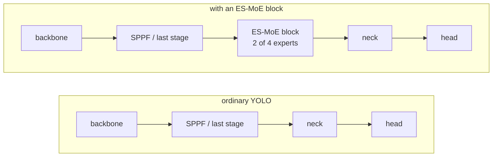
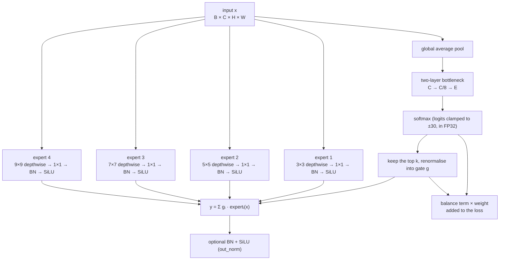

# ES-MoE and YOLO

Three things on this page: what an ES-MoE block adds to an ordinary YOLO, how the block computes in training and in inference, and how this package compares, item by item, with YOLO-Master's `ES_MOE` and with the claims of the paper.

## An ordinary YOLO and one with an ES-MoE block

Every layer of an ordinary YOLO has a fixed structure and fixed weights once trained, and every image goes through the same computation. An ES-MoE block puts several expert branches side by side at one position, and a small router picks k of them for each image; which ones it picks changes with the input.

| | ordinary YOLO | with an ES-MoE block |
|:--:|:--:|:--:|
| computation per image | fixed, the same for every image | the router picks k experts per image, so it follows the input |
| kernels | fixed per layer | the side-by-side experts use different kernels (3, 5, 7, 9), hence different receptive fields |
| training loss | box, cls, dfl | plus a balance term (the auxiliary loss) that reaches backward() |
| parameters (YOLOv8n, 80 classes) | 3,157,200 | 3,471,732, with one block at the end of the backbone |
| placement | — | one block at the end of the backbone by default; `at="backbone_stages"` puts one after every stage |

## Inside the block

The router picks per image, not per pixel. Each expert is a depthwise-separable convolution: the k×k depthwise convolution handles space and the 1×1 pointwise convolution mixes channels. The output is the gated sum of the chosen experts, with the gate renormalised over the k chosen so it sums to one.

## Training and inference

| | training | inference |
|:--:|:--:|:--:|
| which experts compute | only the chosen ones by default; with `dense_training=True` all of them, the unchosen multiplied by zero, as upstream does | only the chosen ones |
| pruning | none | with `dynamic_threshold` above zero, an expert whose renormalised share falls below it is skipped too (the leader always stays) |
| balance term | computed and added to the loss | not computed |
| export | — | every expert enters a traced graph, so the exported model still routes per input |

In backpropagation the gradient returns through y = Σ gᵢ · expertᵢ(x) along two paths:

- **To the experts**: scaled by the gate gᵢ. An expert not chosen for an image has a zero gate there, and a zero gradient.
- **To the router**: the detection loss shifts weight among the chosen experts through ∂L/∂gᵢ. Choosing is a discrete step with no gradient, and the renormalised gate depends only on the chosen logits, so an expert outside the top k gets nothing from the detection loss.

That is what the balance term is for: it has to read the full softmax probabilities to give the unchosen experts a gradient. This package's default Switch form reads the probabilities; upstream's term and the paper's eq. 13 read the renormalised gate and give experts outside the top k exactly zero. Without a balance term, or with one that reads the gate, experts die; see [Experiments](experiments.md#routing-and-balancing).

## Against YOLO-Master

| item | YOLO-Master `ES_MOE` | esmoe `ESMoE` |
|:--:|:--:|:--:|
| installation | use the ultralytics fork YOLO-Master maintains | `pip install esmoe`, on official ultralytics |
| backbones | the fork's own configs such as `yolo-master-n` | official YOLOv5n, v8n, v9t, v10n, 11n, 12n and 26n, plus `yolo-master-n` on the fork |
| adding it | write the model config by hand | `equip` registers, grafts, builds and wires the loss in one call; `graft` renumbers layer references; `esmoe graft` on the command line |
| placement | one block after every backbone stage, four in all | one at the end of the backbone by default; `at="backbone_stages"` reproduces the four; layer indices work too |
| experts | depthwise-separable convolutions, kernels 3, 5, 7, 9 | the same; `expert=` takes any callable |
| router | global pool + two-layer bottleneck (reduction 8), logits clamped to ±30 | the same |
| gate | softmax → top-k → renormalise | the same (the paper's eq. 8 and eq. 9 are tested equivalent) |
| output normalisation | BN + SiLU | `out_norm=True` |
| experts in training | all of them compute | `dense_training=True` |
| inference pruning | `dynamic_threshold=0.4` | the same rule, 0.0 (off) by default, configurable |
| balance term | GShard on the gate; the trainer normalises it by its own running magnitude and caps it at 3.0 | four to choose from (Switch, GShard on the gate, GShard on the probabilities, the paper's eq. 13), Switch at weight 0.01 by default; `recipe="upstream"` reproduces the upstream trainer's normalisation, cap, half learning rate for the router and three frozen-expert epochs |
| custom balance terms | — | any `(probs, gate) -> scalar` function, stored in the config by qualified name |
| where settings live | constructor arguments | in the model config line, so they survive the trainer's rebuild; `scripts/blockspec.py` reads them back from a checkpoint |
| export | every expert enters a traced ONNX / TorchScript graph | the same, and the exported model is verified to route per input |
| multi-GPU | DDP | DDP and `compile=True` settings verified; an unrouted expert stays in the graph at zero weight |
| verification | — | 319 tests, including parity tests that rewrite upstream's and the paper's operators from source and compare bit for bit; ten real-training checks in `scripts/verify.py` |
| accuracy against each other | the block adds +0.0104 on the fork (FP32, 3/3) | the block adds +0.0095 on official ultralytics (FP32, 3/3); the gap between the two, +0.0009, is equivalent |

YOLO-Master's released model, rebuilt with this package, matches the fork bit for bit on all four COCO val2017 metrics.

## Against the paper

The claims in the YOLO-Master paper ([arXiv 2512.23273](https://arxiv.org/abs/2512.23273)) that the experiments here can test, with what was observed. The conditions are on [Experiments](experiments.md#scope): VisDrone, nano-scale backbones, 120 epochs from scratch.

| the paper's claim | observed here |
|:--:|:--:|
| soft top-k (eq. 8) in training, hard top-k (eq. 9) in inference | mathematically equivalent, verified by tests: a softmax over the top-k subset equals a full softmax masked and renormalised |
| the balance term (eq. 12, 13) prevents expert collapse | eq. 13 and upstream's gate-reading GShard differ by an affine map; a term that reads the gate has zero gradient outside the top k, and 5 of 6 such checkpoints have dead experts; the default Switch form has 1 in 69 |
| the router makes experts specialise by scale | across 108 block analyses, the correlation of routing probability with object size runs from −0.49 to +0.59 and flips sign across seeds; the leading expert's kernel takes all four values |
| simple regions activate fewer experts | in training exactly k are active; only inference-time pruning with `dynamic_threshold` changes with the input |
| the block goes into both backbone and neck (§3.1) | the paper's Table 5 makes backbone-only the default (62.1 against 54.9 for both), which is this package's default too |
| one block per backbone stage, four in all | under this package's default recipe four blocks trail one (v10n −0.0071, v5n −0.0049, both 0/3); with upstream's full recipe the four blocks are effective in both frameworks |
| output normalisation (the Norm in eq. 2) | +0.0038 on v5n (3/3); offered as the `out_norm` switch |
