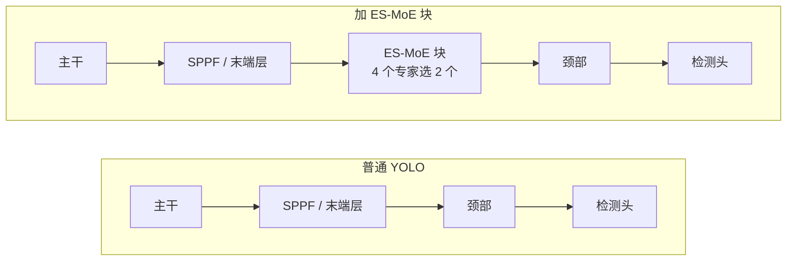
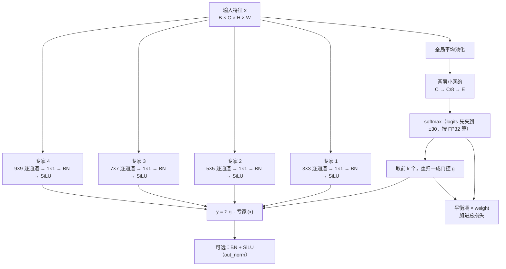

# ES-MoE 与 YOLO

本页讲三件事：ES-MoE 块比普通 YOLO 多了什么，块在训练和推理时各怎么算，以及本包与 YOLO-Master 的 `ES_MOE`、与论文正文逐项对照的结果。

## 普通 YOLO 与加了 ES-MoE 块的 YOLO

普通 YOLO 的每一层结构和权重训练完就固定了，每张图都走同一套计算。ES-MoE 块在同一个位置并排放几个专家分支，由一个小路由器按图挑其中 k 个参与计算，挑谁随输入而变。

| 对比项 | 普通 YOLO | 加 ES-MoE 块 |
|:--:|:--:|:--:|
| 每张图的计算 | 固定，所有图相同 | 路由器按图选 k 个专家，随输入变化 |
| 卷积核 | 逐层写死 | 并排的专家核大小不同（3、5、7、9），感受野不同 |
| 训练损失 | box、cls、dfl | 另加一项平衡项（辅助损失），进入反向传播 |
| 参数量（YOLOv8n，80 类配置） | 3,157,200 | 3,471,732，块只加在主干末端一处 |
| 放在哪 | — | 默认主干末端一块；`at="backbone_stages"` 在每个 stage 后各放一块 |

## 块的内部

路由按整张图选，不按像素选。每个专家是深度可分离卷积：k×k 逐通道卷积负责空间，1×1 逐点卷积负责混通道。输出是被选中专家输出的加权和，门控在选中的 k 个上重归一、和为 1。

## 训练与推理

| | 训练 | 推理 |
|:--:|:--:|:--:|
| 计算哪些专家 | 默认只算被选中的；`dense_training=True` 时全部计算、未选中的乘 0，与上游一致 | 只算被选中的专家 |
| 剪枝 | 不剪 | `dynamic_threshold` 大于 0 时，重归一后份额低于阈值的专家也跳过（首位保留） |
| 平衡项 | 计算并加进总损失 | 不计算 |
| 导出 | — | 追踪时全部专家都进图，导出的模型仍按输入路由 |

反向传播时，梯度沿 y = Σ gᵢ · 专家ᵢ(x) 分两路回去：

- **到专家**：梯度乘上门控 gᵢ。没被选中的专家在这张图上门控为 0，梯度也为 0。
- **到路由器**：检测损失通过 ∂L/∂gᵢ 调整被选中专家之间的权重。选谁是离散操作，没有梯度；重归一后的门控只依赖被选中那几个的 logits，所以没进前 k 的专家从检测损失拿不到梯度。

这就是平衡项存在的原因：它要读完整的 softmax 概率，才能让没被选中的专家也收到梯度。本包默认的 Switch 形式读概率；上游与论文式 13 读重归一后的门控，对前 k 之外的专家梯度恒为零，实测去掉平衡项或只读门控时会出现死专家，见[实验](experiments.md#路由与平衡项)。

## 与 YOLO-Master 的对照

| 项 | YOLO-Master `ES_MOE` | esmoe `ESMoE` |
|:--:|:--:|:--:|
| 安装方式 | 使用 YOLO-Master 维护的 ultralytics 分支 | `pip install esmoe`，装在官方 ultralytics 上 |
| 支持的主干 | 分支自带的 `yolo-master-n` 等配置 | 官方 YOLOv5n、v8n、v9t、v10n、11n、12n、26n 七代，以及 YOLO-Master 分支上的 `yolo-master-n` |
| 接入 | 手写模型配置 | `equip` 一个调用完成注册、嫁接、构建与接损失；`graft` 自动重编号层引用；命令行 `esmoe graft` |
| 块的位置 | 主干每个 stage 后一块，共四块 | 默认主干末端一块；`at="backbone_stages"` 复刻四块；也可给层号 |
| 专家 | 深度可分离卷积，核 3、5、7、9 | 相同；`expert=` 可换成任意可调用对象 |
| 路由器 | 全局池化 + 两层瓶颈（reduction 8），logits 夹到 ±30 | 相同 |
| 门控 | softmax → top-k → 重归一 | 相同（论文式 8 与式 9 已由测试验证等价） |
| 输出归一化 | 有 BN + SiLU | `out_norm=True` 打开 |
| 训练期专家 | 全部计算 | `dense_training=True` 对齐 |
| 推理剪枝 | `dynamic_threshold=0.4` | 同一规则，默认 0.0 不剪，可配 |
| 平衡项 | GShard，读门控；训练器按自身幅值的滑动平均归一并封顶 3.0 | 四种可选（Switch、GShard 读门控、GShard 读概率、论文式 13），默认 Switch、权重 0.01；`recipe="upstream"` 复刻上游训练器的归一、封顶、路由器半学习率与前三个 epoch 冻结专家 |
| 自定义平衡目标 | — | 任意 `(probs, gate) -> 标量` 函数，按模块限定名写进配置 |
| 设置的保存 | 配置参数 | 设置写进模型配置行，训练器重建模型后仍生效；`scripts/blockspec.py` 可从检查点读回 |
| 导出 | ONNX / TorchScript 追踪时全部专家进图 | 相同，另验证导出后的模型仍按输入路由 |
| 多卡 | DDP | DDP 与 `compile=True` 的设置已验证，未被路由的专家以零权重留在图里 |
| 验证 | — | 319 项测试，其中与上游、论文的对照测试按源码重写算子逐位比较；`scripts/verify.py` 十项真训练检查 |
| 精度对照 | 块在分支上 +0.0104（FP32，3/3） | 块在官方 ultralytics 上 +0.0095（FP32，3/3）；两者之差 +0.0009，等效 |

YOLO-Master 发布的模型用本包重建之后，在 COCO val2017 上的四项指标与分支上逐位一致。

## 与论文正文的对照

YOLO-Master 论文（[arXiv 2512.23273](https://arxiv.org/abs/2512.23273)）中能在本仓库的实验里检验的主张，逐条列出观测结果。实验条件见[实验](experiments.md#口径)：VisDrone、nano 量级主干、从零训练 120 epoch。

| 论文的主张 | 本仓库的观测 |
|:--:|:--:|
| soft top-k（式 8）训练、hard top-k（式 9）推理 | 数学等价，已由测试验证：对 top-k 子集做 softmax 等于全体 softmax 后掩码重归一 |
| 平衡项（式 12、13）防止专家塌缩 | 式 13 与上游的 GShard 读门控，二者只差一个仿射变换；读门控的目标对前 k 之外的专家梯度为零，6 个检查点里 5 个出现死专家；本包默认的 Switch 形式在 69 个检查点里只有 1 个 |
| 路由引导专家按尺度分工 | 108 次块分析里，路由概率与目标尺寸的相关在 −0.49 到 +0.59 之间，跨 seed 变号；主导专家的核在四种里都出现过 |
| 简单区域激活更少专家 | 训练期激活数恒为 k；随输入变化的只有推理期的 `dynamic_threshold` 剪枝 |
| 块同时放进主干与颈部（§3.1） | 论文 Table 5 把只放主干定为默认（62.1 对两处都放的 54.9），本包默认与之一致 |
| 主干每 stage 一块、共四块 | 在本包默认配方下，四块比单块差（v10n −0.0071、v5n −0.0049，均 0/3）；换成上游的完整配方后，四块在两个框架里都判有效 |
| 输出归一化（式 2 的 Norm） | v5n 上 +0.0038（3/3）；本包作为 `out_norm` 开关提供 |
