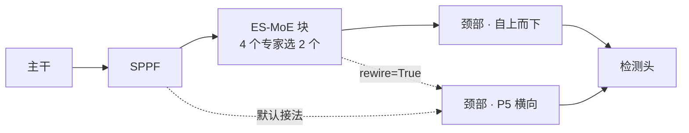
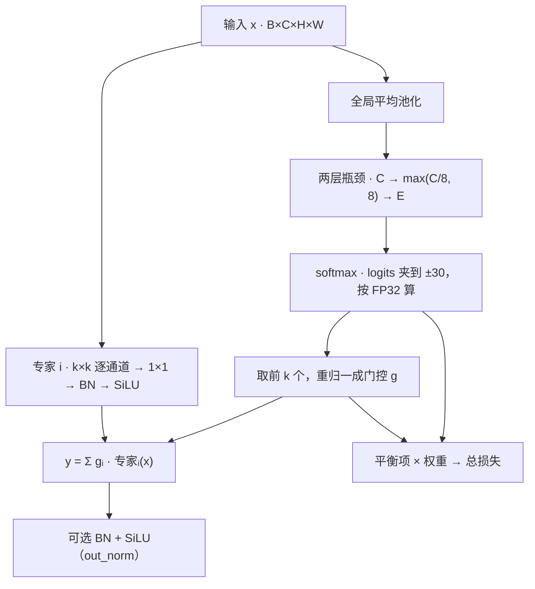

# ES-MoE 与 YOLO

本页讲三件事：ES-MoE 块比普通 YOLO 多了什么，块在训练和推理时怎么算，以及本包与 YOLO-Master 的实现、与论文正文逐项对照的结果。上游代码以 YOLO-Master 分支的 `acce839c` 为准，论文为 [arXiv 2512.23273](https://arxiv.org/abs/2512.23273)。

## 结构对比

普通 YOLO 的每一层结构和权重训练完就固定了，每张图走同一套计算。ES-MoE 块在同一个位置并排放几个专家分支，由一个小路由器按图挑其中 k 个参与计算，挑谁随输入而变。

<figure class="es-fig es-fig--diagram">
<figcaption>块接在主干末端<em>默认接法与改接的区别只在 P5 横向连接读哪一个张量</em></figcaption>

</figure>

| 项 | 普通 YOLO | 加 ES-MoE 块 |
|:--:|:--:|:--:|
| 每张图的计算 | 固定 | 路由器按图选 k 个专家 |
| 卷积核 | 逐层写死 | 并排的专家核大小不同（3、5、7、9） |
| 训练损失 | box、cls、dfl | 另加平衡项（辅助损失） |
| 参数量（YOLOv8n，80 类） | 3,157,200 | 3,471,732 |
| 位置 | — | 默认主干末端一块；`at="backbone_stages"` 每个 stage 后一块 |

## 块的内部

<figure class="es-fig es-fig--diagram">
<figcaption>一个块的前向<em>路由器与专家并行，输出是被选中专家的加权和</em></figcaption>

</figure>

路由按整张图选，不按像素或区域选。每个专家是深度可分离卷积：k×k 逐通道卷积处理空间，1×1 逐点卷积混合通道。门控只在被选中的 k 个专家上非零，并重归一为和 1。

## 训练与推理

| | 训练 | 验证与推理 |
|:--:|:--:|:--:|
| 计算哪些专家 | 默认只算这一批里被选中的；`dense_training=True` 时全部计算、未选中的乘 0，与上游一致 | 只算被选中的专家 |
| 剪枝 | 不剪 | `dynamic_threshold` 大于 0、`sparse_inference` 开启且 k 小于专家数时，重归一后份额低于阈值的专家也跳过，首位保留 |
| 平衡项 | 加进总损失，参与更新 | 同样算出，计入验证损失，不参与更新 |
| 导出 | — | 追踪时全部专家进图，导出的模型仍按输入路由 |

反向传播沿 y = Σ gᵢ · 专家ᵢ(x) 走两路：

- **到专家**：梯度乘上门控 gᵢ。某张图没选中的专家，门控为 0，沿这条路径得到的梯度为 0。
- **到路由器**：检测损失通过 ∂L/∂gᵢ 调整被选中专家之间的份额。选谁是离散操作，没有梯度；重归一后的门控只依赖被选中那几个的 logits，没进前 k 的专家从检测损失拿不到梯度。

平衡项因此必须读完整的 softmax 概率，没被选中的专家才收到梯度。本包默认的 Switch 形式读概率；上游与论文式 13 读重归一后的门控，对前 k 之外的专家梯度为零。实测去掉平衡项的 6 个检查点全部出现死专家，读门控的 6 个里 5 个出现，见[实验](experiments.md#路由与平衡项)。

## 对照 YOLO-Master

| 项 | YOLO-Master `ES_MOE` | esmoe `ESMoE` |
|:--:|:--:|:--:|
| 安装 | 使用 YOLO-Master 维护的 ultralytics 分支 | `pip install esmoe`，装在官方 ultralytics 上 |
| 主干 | 分支自带的 `yolo-master-n` 等配置 | 官方 YOLOv5n 至 YOLO26n 七代，以及分支上的 `yolo-master-n` |
| 接入 | 手写模型配置 | `equip` 一次完成注册、嫁接、构建与接损失；`graft` 自动重编号层引用；命令行 `esmoe graft` |
| 位置 | `yolo-master-n` 在 P2、P3 的 C3k2 与 P4、P5 的 A2C2f 之后各一块 | 默认主干末端一块；`at="backbone_stages"` 在每个下采样 stage 后各放一块，在 `yolo-master-n` 上与上游位置相同 |
| 专家 | 深度可分离卷积；不超过 3 个专家时核为 3、5、7，更多时依次加 2 | 相同；`expert=` 可换成任意可调用对象 |
| 路由器 | 全局池化 + 两层 1×1 卷积，隐层 `max(C/8, 8)`，logits 夹到 ±30 | 相同（线性层实现，数值等价） |
| 门控 | 训练与导出用 soft top-k，推理用 hard top-k | 相同，两者由测试验证等价 |
| 输出归一化 | 固定有 BN + SiLU | `out_norm=True` 打开 |
| 训练期专家 | 全部计算 | `dense_training=True` 对齐 |
| 推理剪枝 | `dynamic_threshold=0.4`，首位保留 | 同一规则，默认 0.0 不剪 |
| 平衡项 | GShard 读门控，系数 1.0；训练器按滑动平均归一、封顶 3.0，分别加到 box、cls、dfl 三项；滑动平均存进检查点 | 四种可选，默认 Switch、权重 0.01；`recipe="upstream"` 复刻归一、封顶、三项相加、路由器半学习率与前三个 epoch 冻结专家；滑动平均不存进检查点，续跑从头累计 |
| 多卡 | 专家利用率先跨卡 all-reduce 再求平方；`find_unused_parameters=True` | 平衡项按单卡计算；DDP 与 `compile=True` 下未被路由的专家以零权重留在图里 |
| 精度回退 | 损失或梯度非有限时关闭混合精度并重放该 epoch；出现 NaN 时回滚检查点 | 沿用官方训练器，不回退 |
| 其他机制 | 导出前剪枝专家；按 Gini 系数与 mAP 饱和调度平衡系数；`set_top_k`、`enable_sparse_inference` | 没有这些机制；`configure` 可在不经训练器的场合改块的设置 |
| 设置保存 | 构造函数参数 | 写进模型配置行，训练器重建模型后仍生效；`scripts/blockspec.py` 从检查点读回 |
| 自定义平衡目标 | — | 任意 `(probs, gate) -> 标量` 函数，按模块限定名写进配置 |
| 验证 | — | 测试按上游与论文的源码重写算子做数值对照；`scripts/verify.py` 十项真训练检查 |
| 精度 | 块在分支上 mAP50 +0.0104（FP32，3/3） | 块在官方 ultralytics 上 +0.0095（FP32，3/3）；两者之差 +0.0009，等效 |

YOLO-Master 发布的 `yolo-master-n` 权重是每块 3 个专家、3 个全开。装进本包的块后，在 COCO val2017 上的四项指标与分支到小数点后五位一致，参数量同为 2,694,364。

## 对照论文

论文中能在本仓库实验里检验的主张，与实测结果逐条对照。实验条件见[实验](experiments.md#口径)：VisDrone、nano 量级主干、从零训练 120 epoch。

| 论文 | 实测 |
|:--:|:--:|
| 训练用 soft top-k（式 8），推理用 hard top-k（式 9） | 两式到 ε 为止相等，已由测试验证 |
| 平衡项（式 12、13）防止专家塌缩 | 式 13 与上游读门控的 GShard 只差一个仿射变换；读门控的目标对前 k 之外的专家梯度为零，6 个检查点里 5 个出现死专家；权重 0.01 的 Switch 在 66 个检查点里一个没有 |
| 路由让专家按尺度分工 | 132 次块分析、528 个相关系数在 −0.49 到 +0.59 之间，283 个为正、245 个为负；多 seed 的 96 组里 76 组跨 seed 变号；主导专家的核四种都出现过 |
| 简单区域激活更少专家（§2.3） | 路由器对整张图池化，同一张图内的区域无法选不同专家；式 7、8 固定 k，训练期激活数恒为 k；随输入变化的只有推理期的 `dynamic_threshold` 剪枝 |
| 块放进主干与颈部（§3.1） | 论文 Table 5 以只放主干为默认（62.1，两处都放 54.9，未注明数据集，62.1 与 Table 1 的 VOC 一列相同）。该方案参数只增 0.03M，与上游配置里的四块（+523,000）不是同一布局；本包默认同样只放主干，只放一块 |
| 专家数与 k（Table 6、7） | 论文取 4 专家、top-2；本包选型在另一套预算下得出同样的配置 |
| 损失设置（Table 8 Config 5） | 论文去掉 DFL、平衡项系数 1.5；上游保留 DFL、系数 1.0 并归一；本包保留 DFL、默认权重 0.01 |
| 鼓励专家互补的目标（摘要） | 方法部分只定义了式 13；上游 `ES_MOE` 不使用带多样性项的 `MoELoss`（该项默认为 0）；两边都没有实现 |
| 输出归一化（式 2 的 Norm） | v5n 上 +0.0038（3/3）；本包作为 `out_norm` 开关提供 |
| 训练设置（§4.1） | 论文以 YOLOv12-N 为基线、640 像素、600 epoch、批大小 256；本仓库在 VisDrone 上从零训练 120 epoch、800 像素，两者的数字不可直接比较 |
