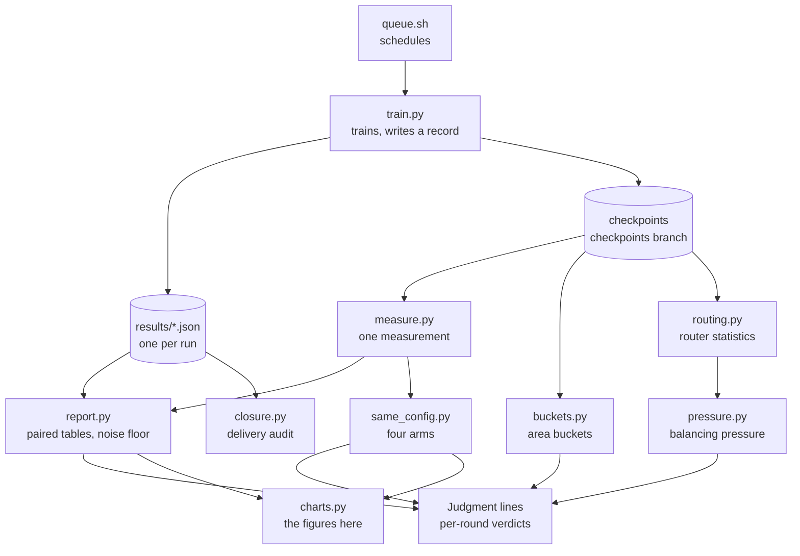

# Experiments

Every experiment in the repository in one place: the data, the training protocol, the steps one experiment goes through, what each of the eight rounds asked, and the results of the same-configuration comparison with YOLO-Master, the repeated runs, and the routing and balancing analysis. The figures are interactive: hover for detail, click a legend entry to toggle a series, save a PNG from the top-right corner. `scripts/charts.py` computes every number from the records in [`results/`](https://github.com/Lfan-ke/ES-MoE/tree/main/results), the same source as the tables in [Results](results.md) and the verdicts in [Judgment lines](JUDGMENT.md).

<strong>142</strong>full-protocol training runs

<strong>600</strong>card-hours

<strong>8</strong>backbones, seven YOLO generations and yolo-master-n

<strong>11</strong>pre-registrations committed before their results

## Dataset

VisDrone2019-DET: drone imagery, 10 classes. Training uses the train split only; every mAP, area bucket and routing statistic is computed on the 548 validation images. The test split is fingerprinted and never evaluated.

| split | images | boxes | per image | image bytes | median box side (original / letterboxed to 800 px) |
|:--:|:--:|:--:|:--:|:--:|:--:|
| train | 6,471 | 343,205 | 53.0 | 1.55 GB | 26.1 / 13.9 px |
| val | 548 | 38,759 | 70.7 | 0.08 GB | 22.8 / 14.1 px |
| test | 1,610 | 75,102 | 46.6 | 0.31 GB | 21.9 / 12.3 px |

A drone image holds 53 objects on average, and most of them are small: by COCO's area buckets, 208 thousand of the 343 thousand training boxes are small (under 32²). That is why the protocol letterboxes to 800 px rather than 640.

The train split comes in 11 resolutions, from 960×540 to 2000×1500; val has three. The right-hand figure shows box sides after letterboxing to 800 px: the median sits between 12 and 14 px in all three splits. `scripts/dataset.py` reads these statistics from the dataset archive into `results/dataset.json`; its small, medium and large counts on val (26,586 / 11,105 / 1,068) match the ground truth in `results/buckets.md`.

## Training protocol

| item | value |
|:--:|:--:|
| data | the full VisDrone2019-DET train split (`fraction=1.0`), 548 validation images |
| input size | `imgsz=800` |
| length | 120 epochs, `patience=0` (no early stop) |
| batch | 32 |
| initialisation | from scratch, no pretrained weights |
| seeds | three or more per cell; every arm of a seed trains on the same card and pairs with that seed's baseline |
| precision | mixed by default; the eighth round against YOLO-Master runs FP32 throughout (`--amp 0`) |
| evaluation | ultralytics' validator; for the same-configuration comparison `scripts/measure.py` rebuilds each model from its own config and measures the EMA weights of `last.pt` with one set of arguments |
| hardware | MetaX C500 (105 runs, 531 card-hours) and RTX 4090 (37 runs, 69 card-hours) |

One full-protocol run takes 4 to 10 hours on a MetaX C500 and sees about 777 thousand images. The figure shows how the 142 runs spread over backbones.

## How one experiment runs

Before a round starts, the question, the criteria and the prediction are committed to [Judgment lines](JUDGMENT.md), with the git timestamp as evidence; the verdict is written after the results, and a prediction the data overturned stays in its original words.

## Eight rounds

| round | question | outcome |
|:--:|:--:|:--:|
| 1 | Do the default wiring and `rewire` help on four backbones? | default effective on v8n and 11n, not on 12n and 26n; `rewire` clears the line on v8n, 11n, 12n |
| 2 | Adding v5n, v9t and v10n, how does the effect follow the backbone? | it groups by the end of the backbone: SPPF-ended positive, attention-ended flat, area attention and E2E heads negative |
| 3 | Does upstream's GShard term undo routing collapse? | the settings never reached the trained model; the five records join the default arm as repeated runs and give the mixed-precision noise floor 0.0045 / 0.0130 |
| 4 | Does a term that reads the gate undo the collapse? | no: dispatch concentrates further and the first dead expert appears |
| 5 | What do output normalisation, dense training and the four-block layout each do? | output normalisation +0.0038 and dense training +0.0031, both 3/3; four blocks −0.0071, 0/3 |
| 6 | Is the four-block loss about block count or total auxiliary loss, and what does the balance term guard against? | block count; the term keeps experts alive, and a term reading the gate has zero gradient outside the top-k |
| 7 | Same configuration as YOLO-Master, each framework's default precision | the block acts the same in both frameworks (difference of differences −0.0004, equivalent); adding the block helps on both sides |
| 8 | Does it hold with all four arms in FP32, and how large is the FP32 noise floor? | difference of differences +0.0009, still equivalent; both blocks effective by the judgment lines; FP32 floor 0.0038 / 0.0103, the same order as mixed precision |

The per-seed paired deltas of the seven-generation matrix are on [Effect chart](charts.md).

## Same configuration as YOLO-Master

One `yolo-master-n`, one protocol, trained on YOLO-Master's fork and on official ultralytics with this package. The four arms of a seed share a card, so every difference is taken inside a card.

| arm | framework | blocks | training |
|:--:|:--:|:--:|:--:|
| A | YOLO-Master's fork (pinned `acce839c`) | four `ES_MOE` | upstream trainer |
| A0 | YOLO-Master's fork | none | upstream trainer |
| B | official ultralytics 8.4.101 + esmoe | four `ESMoE` | `recipe="upstream"` |
| C | official ultralytics 8.4.101 | none | official trainer |

Each difference answers one question: A − B compares the two implementations as a whole; A − A0 and B − C are what the block adds inside each framework; the difference of differences (A − A0) − (B − C) is how much the block's effect differs between frameworks, with the frameworks' own differences cancelled. In the figure the line is the 95% interval, the large dot the mean and the small dots the three seeds.

| precision | A − B | A − A0 | B − C | difference of differences |
|:--:|:--:|:--:|:--:|:--:|
| mixed (round 7) | −0.0069, undecided | +0.0122, effective | +0.0126, effective | −0.0004, equivalent |
| FP32 (round 8) | +0.0046, undecided | +0.0104, effective | +0.0095, effective | +0.0009, equivalent |

Both rounds put the difference of differences in the equivalent band: the same block adds the same amount on YOLO-Master's fork and on official ultralytics. In round 7 the upstream trainer switched A and A0 to FP32 in the first epoch while B and C stayed mixed, so round 8 repeated all four arms in FP32; the conclusion holds.

Under mixed precision the B arm is faster than A; in FP32 both take about 10.6 hours, so the time gap comes from precision, not from the implementation.

## Repeated runs

Train one configuration twice with the same seed on the same card: how far apart does mAP50 land? That gap is the denominator of every effect. A difference smaller than it is reported as a direction, not a magnitude.

Five mixed-precision pairs differ by 0.0045 on average and 0.0130 at most; five FP32 pairs by 0.0038 and 0.0103, the same order. Rounds 7 and 8 take their lines from these numbers: a mean within the average gap with an interval that crosses zero is equivalent; a mean beyond the largest gap, or three seeds of one sign with an interval clear of zero, is not.

## Routing and balancing

The routing analysis reads each checkpoint's routing probabilities on the 548 validation images: how often each expert is the top-1 choice, how often it is in the top-2, and which experts are dead (in the top-2 for under 1% of images).

Over the 81 checkpoints that have both a routing analysis and a paired delta, the leading expert's top-1 share and the paired mAP50 delta are nearly unrelated (r = +0.044): a concentrated dispatch does not cost accuracy. Large dots are four-block layouts.

Left: with the Switch term at weight 0.01, none of the 60 single-block checkpoints has a dead expert, and of the 9 four-block ones only the run with the per-block weight cut to 0.0025 does; all 6 without a balance term do. Terms that read the gate (upstream's GShard and the paper's eq. 13) give experts outside the top-k no gradient, and 5 of their 6 checkpoints have dead experts. Right: the gradient each term puts on the router logits per unit weight (median, log scale). The gate-reading form matches Switch in magnitude and eq. 13 sits one to two orders lower, so dead experts are not a matter of too little pressure.

The B arm of the same-configuration comparison, block by block and expert by expert: colour is the share of images that put the expert in the top-2, and a red cell is a dead expert. The first three blocks lose experts in all six checkpoints; only the fourth keeps all four working.

## Scope

- Numbers come from VisDrone2019-DET, nano-scale backbones trained from scratch, one machine and one card each. They are not COCO numbers and are not compared with the official VisDrone leaderboard.
- Three seeds do not support a significance test: 3/3 wins give a sign-test p of 0.125. Most mean paired deltas sit within the noise floor, so conclusions are stated as directions.
- Two cells have fewer than three seeds: `yolov5n-e4k2w0.01-rewire` on the metax3.7 host has seed 0 only (the same arm has all three seeds on metax3.3), and `yolov10n-e4k2w0.01-norm` has seed 0 only (output normalisation is read from the three seeds on v5n). Neither enters a mean.
- The area buckets (under 32², 32² to 96², 96² and up, on boxes in the original image) are the COCO definition, evaluated with `maxDets=500`, and are kept apart from the training records' metrics at `max_det=300`.

## Recompute

    uv run python scripts/dataset.py VisDrone_dataset.zip   # dataset statistics
    uv run python scripts/report.py                         # paired tables and noise floor
    uv run python scripts/same_config.py                    # four arms
    uv run python scripts/charts.py                         # data for this page and the effect chart

Checkpoints, training arguments and per-epoch curves are on the [`checkpoints` branch](https://github.com/Lfan-ke/ES-MoE/tree/checkpoints); the area buckets and routing statistics can be recomputed from there.
