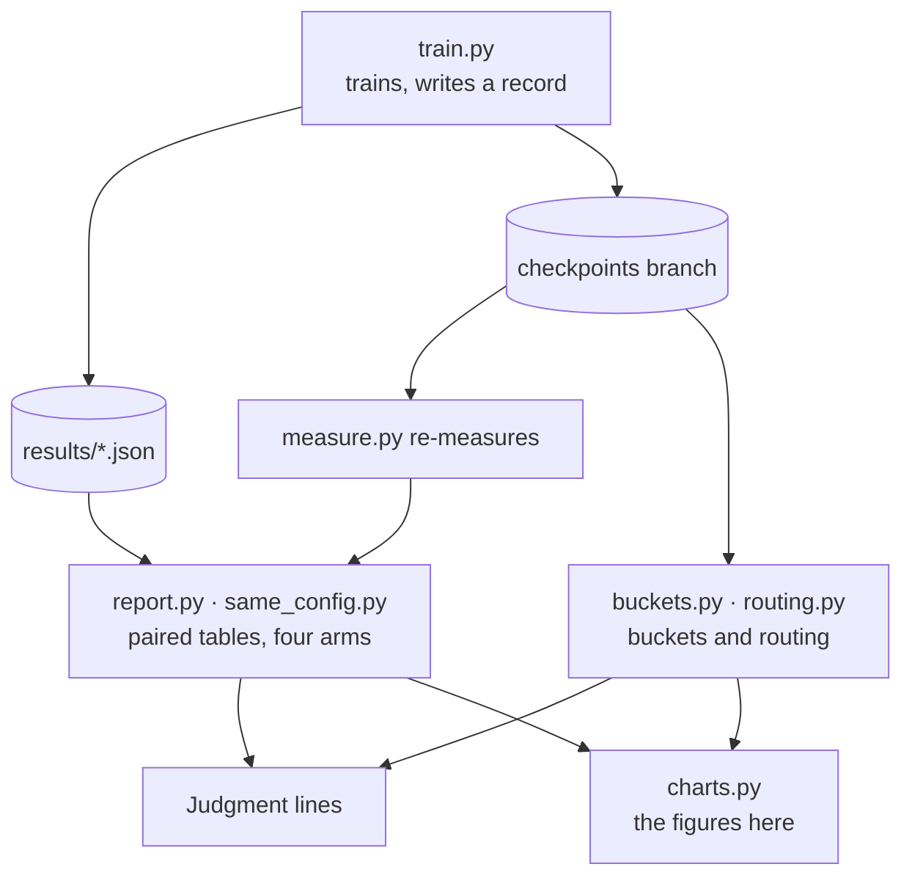

# Experiments

Every experiment in the repository is on this page: the data, the protocol, the pipeline, and every result of the eight rounds. Each conclusion comes with a figure. The figures are interactive, and `scripts/charts.py` computes their numbers from [`results/`](https://github.com/Lfan-ke/ES-MoE/tree/main/results), the same source as the tables in [Results](results.md) and the verdicts in [Judgment lines](JUDGMENT.md).

<strong>142</strong>full-protocol runs

<strong>600</strong>card-hours

<strong>8</strong>backbones

<strong>11</strong>pre-registrations

## Dataset

VisDrone2019-DET: drone imagery, 10 classes. Training uses the train split only; mAP, area buckets and routing statistics are computed on the 548 validation images; the test split is fingerprinted and never evaluated.

| split | images | boxes | per image | size | median box side (original / 800 px) |
|:--:|:--:|:--:|:--:|:--:|:--:|
| train | 6,471 | 343,205 | 53.0 | 1.55 GB | 26.1 / 13.9 |
| val | 548 | 38,759 | 70.7 | 0.08 GB | 22.8 / 14.1 |
| test | 1,610 | 75,102 | 46.6 | 0.31 GB | 21.9 / 12.3 |

<figure class="es-fig" id="fig-1">
<figcaption><b>Fig. 1</b>Size of the three splits<em>images (left axis) and boxes (right axis)</em></figcaption>

<small>Data: <code>results/dataset.json</code></small>
</figure>

A drone image holds 53 objects on average, and most of them are small: by COCO's area buckets, 208 thousand of the 343 thousand training boxes are under 32². That is why the protocol letterboxes to 800 px rather than 640.

<figure class="es-fig es-fig--tall" id="fig-2">
<figcaption><b>Fig. 2</b>Boxes per class<em>sorted by the train split</em></figcaption>

<small>Data: <code>results/dataset.json</code></small>
</figure>

<figure class="es-fig" id="fig-3">
<figcaption><b>Fig. 3</b>Image resolutions<em>top eight</em></figcaption>

</figure>
<figure class="es-fig" id="fig-4">
<figcaption><b>Fig. 4</b>Box side<em>share after letterboxing to 800 px</em></figcaption>

</figure>

Train resolutions run from 480×360 to 2000×1500; val has three. After letterboxing to 800 px, the median box side of the three splits sits between 12.3 and 14.1 px. `scripts/dataset.py` reads these statistics from the dataset archive; its small, medium and large counts on val (26,586 / 11,105 / 1,068) match the ground truth in `results/buckets.md`.

## Protocol

| item | value |
|:--:|:--:|
| data | the full train split (`fraction=1.0`), 548 validation images |
| input | `imgsz=800` |
| length | 120 epochs, `patience=0` |
| batch | 32 |
| initialisation | from scratch |
| seeds | three or more per cell (two exceptions, see [Scope](#scope)); every arm of a seed trains on the same card and pairs by seed |
| precision | mixed by default; round eight is FP32 throughout (`--amp 0`) |
| evaluation | ultralytics' validator; for the same-configuration comparison `scripts/measure.py` re-measures the EMA weights of `last.pt` with one set of arguments |
| hardware | MetaX C500, 105 runs and 531 card-hours; RTX 4090, 37 runs and 69 card-hours |

One full-protocol run takes 2.3 to 10.8 hours on a MetaX C500 and sees about 777 thousand images.

<figure class="es-fig" id="fig-5">
<figcaption><b>Fig. 5</b>The 142 runs by backbone<em>runs (bars) and card-hours (line)</em></figcaption>

<small>Data: <code>results/*.json</code></small>
</figure>

## Pipeline

<figure class="es-fig es-fig--diagram" id="fig-6">
<figcaption><b>Fig. 6</b>The scripts one experiment passes through<em>train, re-measure, analyse, judge</em></figcaption>

</figure>

Before a round starts, its question, criteria and prediction are committed to [Judgment lines](JUDGMENT.md), with the git timestamp as evidence; the verdict is written after the results, and a prediction the data overturned keeps its original words.

## Eight rounds

| round | question | outcome | figure |
|:--:|:--:|:--:|:--:|
| 1 | Do the default wiring and `rewire` help on four backbones? | effective on v8n and 11n, not on 12n and 26n | [9](#fig-9) |
| 2 | Adding v5n, v9t and v10n, how does the effect follow the backbone? | grouped by the end of the backbone: SPPF-ended positive, attention-ended flat, E2E heads negative | [9](#fig-9), [10](#fig-10) |
| 3 | Does upstream's GShard term undo the collapse? | the settings never reached the trained model; the five records became repeated runs and gave the noise floor | [18](#fig-18) |
| 4 | Does a term that reads the gate undo the collapse? | no: dispatch concentrates further and the first dead expert appears | [19](#fig-19), [20](#fig-20) |
| 5 | What do output normalisation, dense training and four blocks each do? | output normalisation +0.0038, dense training +0.0031 (v5n, both 3/3); four blocks −0.0071 | [11](#fig-11) |
| 6 | Is the four-block loss about block count or total auxiliary loss, and what does the balance term guard? | block count; the balance term keeps experts alive | [11](#fig-11), [20](#fig-20), [21](#fig-21) |
| 7 | Same configuration as YOLO-Master, default precision | the block acts the same in both frameworks, and adding it helps on both sides | [12](#fig-12)–[17](#fig-17) |
| 8 | Does it hold in FP32 throughout, and how large is the FP32 noise floor? | the difference of differences stays equivalent; noise floor 0.0038 / 0.0103 | [13](#fig-13), [18](#fig-18) |

## Selection

The default configuration was picked on a 25% train split, 640 px and 20 epochs, then checked on the full data and longer schedules. The whole process is on [Selection](SELECTION.md).

<figure class="es-fig" id="fig-7">
<figcaption><b>Fig. 7</b>Candidates<em>25% train split, 20 epochs, bar for seed 0</em></figcaption>

</figure>
<figure class="es-fig" id="fig-8">
<figcaption><b>Fig. 8</b>Schedule and backbone<em>full train split, three seeds per cell</em></figcaption>

</figure>

Configurations that route to a single expert lose to the baseline; 4 experts with top-2 are positive on all three seeds. On the full data, the means at 20, 50 and 100 epochs and at the protocol's 120 epochs are all positive but do not move in one direction with the schedule; the same configuration on YOLO11n is positive on 1 of 3 seeds.

## Seven generations

Per-seed paired deltas of the default wiring and `rewire` on seven backbone generations from YOLOv5n to YOLO26n. The grey band is the mixed-precision noise floor.

<figure class="es-fig" id="fig-9">
<figcaption><b>Fig. 9</b>Paired deltas across seven generations<em>dots for seeds, a short bar for the mean of three</em></figcaption>

<small>Data: <code>results/summary.md</code></small>
</figure>

The default wiring is positive on SPPF-ended backbones (v5n +0.0055, v8n +0.0025, v9t +0.0025), sits on zero once the backbone ends in attention (v10n −0.0002, 11n +0.0013), and turns negative on 12n and 26n. `rewire` trails the default on v5n, v9t, v10n and 11n, and comes back near parity on 12n and 26n.

<figure class="es-fig" id="fig-10">
<figcaption><b>Fig. 10</b>Split by object size<em>paired deltas in COCO area buckets, bars for the mean of three seeds</em></figcaption>

<small>Data: <code>results/buckets.md</code></small>
</figure>

The buckets show no consistent size trade-off: with the default wiring on v8n large objects get worse on all three seeds (APl −0.0104), and `rewire` turns that positive; on 26n it is small objects that lose (APs −0.0045, 0/3).

<figure class="es-fig es-fig--tall" id="fig-11">
<figcaption><b>Fig. 11</b>Alignment arms<em>upstream's settings inside the block, four blocks and balance terms, each against the same-seed baseline</em></figcaption>

<small>Data: <code>results/summary.md</code></small>
</figure>

Output normalisation (+0.0038) and dense training (+0.0031) are both 3/3 on v5n; dense training is flat on v10n (+0.0001, 1/3). Four blocks are 0/3 on both v10n and v5n; with each block's weight cut to 0.0025 so the total auxiliary loss matches one block, v10n is still −0.0113, so the loss is about the number of blocks.

## Same configuration

One `yolo-master-n`, one protocol, trained on YOLO-Master's fork and on official ultralytics with this package. The four arms of a seed share a card, and every difference is taken inside a card.

| arm | framework | blocks | training |
|:--:|:--:|:--:|:--:|
| A | YOLO-Master fork (`acce839c`) | four `ES_MOE` | upstream trainer |
| A0 | YOLO-Master fork | none | upstream trainer |
| B | official ultralytics 8.4.101 + esmoe | four `ESMoE` | `recipe="upstream"` |
| C | official ultralytics 8.4.101 | none | official trainer |

<figure class="es-fig" id="fig-12">
<figcaption><b>Fig. 12</b>Four arms per seed<em>round seven in mixed precision, round eight in FP32</em></figcaption>

<small>Data: <code>results/same_config.md</code></small>
</figure>

A − B compares the two implementations; A − A0 and B − C are what the block adds inside each framework; the difference of differences (A − A0) − (B − C) is how far the block's effect differs between the frameworks, with the frameworks' own differences cancelled.

<figure class="es-fig" id="fig-13">
<figcaption><b>Fig. 13</b>Four differences with 95% intervals<em>large dot for the mean, small dots for seeds, grey band for the noise floor</em></figcaption>

<small>Data: <code>results/same_config.md</code></small>
</figure>

| precision | A − B | A − A0 | B − C | difference of differences |
|:--:|:--:|:--:|:--:|:--:|
| mixed (round 7) | −0.0069, undecided | +0.0122, effective | +0.0126, effective | −0.0004, equivalent |
| FP32 (round 8) | +0.0046, undecided | +0.0104, effective | +0.0095, effective by the judgment lines | +0.0009, equivalent |

In both rounds the difference of differences is in the equivalent band: the same block adds the same amount in both frameworks. In round eight B − C is positive on all three seeds and effective by the opening judgment lines; its interval crosses zero, so under the noise-floor bands it is undecided.

<figure class="es-fig" id="fig-14">
<figcaption><b>Fig. 14</b>Change by object size after adding the block<em>area buckets of A − A0 and B − C</em></figcaption>

<small>Data: <code>results/buckets.md</code></small>
</figure>

With the block added in either framework, small objects gain on all three seeds (APs +0.0049 and +0.0080; in FP32 +0.0086 and +0.0069); large objects gain the most, but on only 2 of 3 seeds.

<figure class="es-fig" id="fig-15">
<figcaption><b>Fig. 15</b>Step-for-step trace<em>solid for the gap between trainers, dashed for one nudged router layer</em></figcaption>

<small>Data: <code>results/recipe_parity.md</code></small>
</figure>
<figure class="es-fig" id="fig-16">
<figcaption><b>Fig. 16</b>Released model re-check<em>COCO val2017, the same weights</em></figcaption>

<small>Data: <code>results/release_check.md</code></small>
</figure>

Fig. 15: the gap between the two trainers traced step for step is the same size as the gap from nudging one router layer of a single trainer by 1e-6, 0.117 against 0.099 at epoch 4, so what remains comes from training amplifying a perturbation, not from the implementation. Fig. 16: YOLO-Master's released weights, loaded into this package's blocks, give the four metrics on official ultralytics that the fork gives, equal to five decimals, with 2,694,364 parameters on both sides.

<figure class="es-fig" id="fig-17">
<figcaption><b>Fig. 17</b>Card-hours per run<em>mean of three seeds</em></figcaption>

<small>Data: <code>results/same_config.md</code></small>
</figure>

In mixed precision B is faster than A; in FP32 both take about 10.6 hours, so the time gap comes from precision.

## Repeated runs

Train one configuration twice with the same seed on the same card: how far apart does mAP50 land? That gap is the denominator of every effect, and a difference smaller than it is reported as a direction only.

<figure class="es-fig" id="fig-18">
<figcaption><b>Fig. 18</b>Gaps between repeated runs<em>five pairs each in mixed precision and FP32</em></figcaption>

<small>Data: <code>results/summary.md</code></small>
</figure>

Mixed precision: mean gap 0.0045, largest 0.0130. FP32: mean 0.0038, largest 0.0103, the same order. The lines of rounds seven and eight come from these numbers.

## Routing and balancing

The routing analysis reads each checkpoint's routing probabilities on the validation images: how often each expert is the top-1 choice, how often it is in the top-2, and which experts are dead (in the top-2 for under 1% of images).

<figure class="es-fig" id="fig-19">
<figcaption><b>Fig. 19</b>Concentration against paired delta<em>large dots for four-block layouts</em></figcaption>

<small>Data: <code>results/routing.md</code></small>
</figure>

Over 81 checkpoints the leading expert's top-1 share and the paired mAP50 delta are nearly unrelated (r = +0.044): a concentrated dispatch does not cost accuracy.

<figure class="es-fig" id="fig-20">
<figcaption><b>Fig. 20</b>Dead experts by balance term<em>counted per checkpoint</em></figcaption>

</figure>
<figure class="es-fig" id="fig-21">
<figcaption><b>Fig. 21</b>Gradient of the balance terms<em>at one weight, median over checkpoints</em></figcaption>

</figure>

With the Switch term at weight 0.01, none of 66 checkpoints has a dead expert, and 1 of the 3 with each block's weight cut to 0.0025 does; all 6 without a balance term do. Terms that read the gate (upstream's GShard and the paper's eq. 13) give experts outside the top-k no gradient, and 5 of their 6 checkpoints have dead experts. In Fig. 21 the gate-reading form matches Switch in size and eq. 13 sits one to two orders lower, so dead experts are not a matter of too little pressure.

<figure class="es-fig es-fig--tall" id="fig-22">
<figcaption><b>Fig. 22</b>Expert use in the B arm<em>share of images in the top-2, red for dead experts</em></figcaption>

<small>Data: <code>results/routing/</code></small>
</figure>

In all six B-arm checkpoints the first three blocks have dead experts; only the fourth block keeps all four experts working.

<figure class="es-fig" id="fig-23">
<figcaption><b>Fig. 23</b>Routing and object size<em>528 correlations</em></figcaption>

</figure>
<figure class="es-fig" id="fig-24">
<figcaption><b>Fig. 24</b>Kernel of the leading expert<em>132 block analyses</em></figcaption>

</figure>

The router does not learn a division of labour by scale: the correlation of routing probability with object size runs from −0.49 to +0.59, 283 positive and 245 negative, and the leading expert's kernel takes all four values.

## Training cost

<figure class="es-fig es-fig--tall" id="fig-25">
<figcaption><b>Fig. 25</b>Card-hours with the block<em>the same-seed, same-card baseline is ×1; four-block layouts in orange</em></figcaption>

<small>Data: <code>results/*.json</code></small>
</figure>

On the seven generations a single block takes 0.97 to 1.10 times the baseline's card-hours; four blocks take more.

## Scope

- The numbers come from VisDrone2019-DET, nano-scale backbones trained from scratch, one machine and one card each. They are not COCO numbers and are not compared with the official VisDrone leaderboard.
- Three seeds support no significance test: 3/3 wins give a sign-test p of 0.125. Most mean paired deltas sit within the noise floor, so conclusions are stated as directions.
- Two cells have fewer than three seeds: `yolov5n-e4k2w0.01-rewire` on the metax3.7 host has seed 0 only (the same arm has three seeds on metax3.3), and `yolov10n-e4k2w0.01-norm` has seed 0 only (output normalisation is read from the three seeds on v5n). Neither enters a mean.
- Area buckets count boxes in the original image and are evaluated with `maxDets=500`, kept apart from the training records' metrics at `max_det=300`.

## Reproduce

Lay out the dataset as `configs/visdrone.yaml` expects (ModelScope `aiEngineer484/VisDrone`) and set its `path`. The three-arm matrix of one backbone:

    IMGSZ=800 EPOCHS=120 FRACTION=1.0 ARMS="baseline esmoe rewire" BASE=yolov8n.yaml uv run bash scripts/sweep.sh

Other arms go through `scripts/queue.sh`, one job per line as `<base.yaml> <arm> <seed> <tag> [aux_weight]`. Once training finishes, recompute the tables and figures:

    uv run python scripts/report.py
    uv run python scripts/same_config.py
    uv run python scripts/charts.py

Checkpoints, training arguments and per-epoch curves are on the [`checkpoints` branch](https://github.com/Lfan-ke/ES-MoE/tree/checkpoints).
