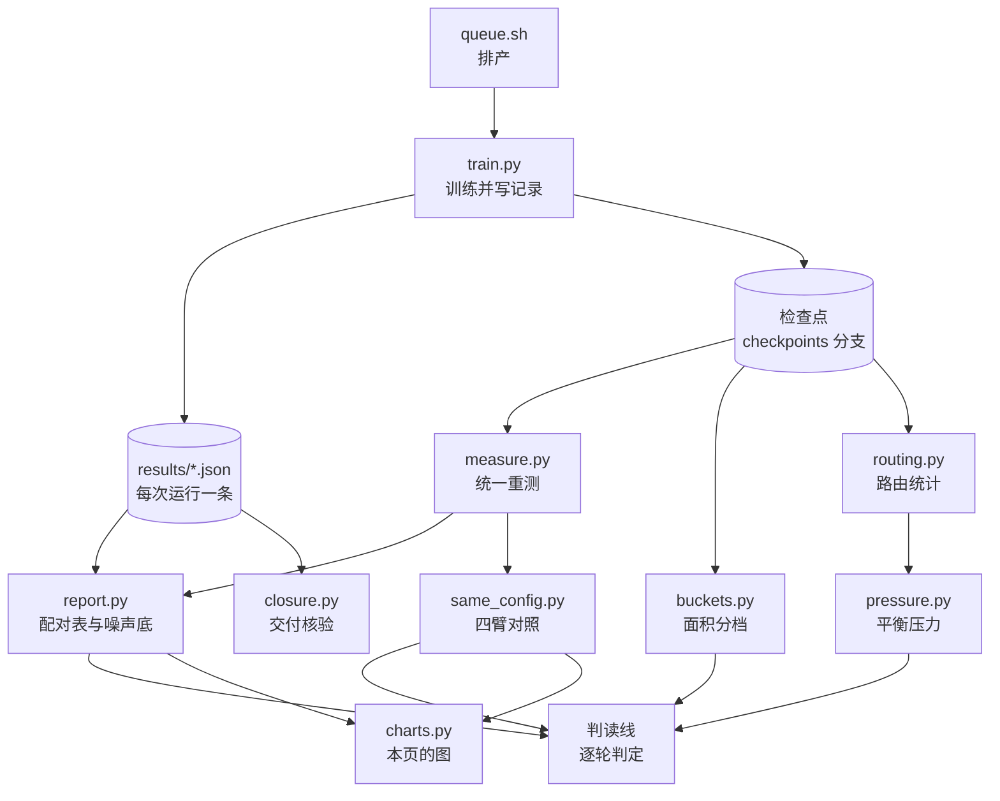

# 实验

本页把仓库里的全部实验摆在一处：用什么数据、按什么协议训练、一次实验经过哪些步骤、八轮各问了什么，以及与 YOLO-Master 同配置对照、同配置重复运行、路由与平衡项的结果。图都可以交互：悬停看明细，点图例开关系列，右上角另存 PNG。数字由 `scripts/charts.py` 从 [`results/`](https://github.com/Lfan-ke/ES-MoE/tree/main/results) 的记录现算，与[实验结果](results.md)的表、[判读线](JUDGMENT.md)的判定同源。

<strong>142</strong>次满协议训练

<strong>600</strong>卡时

<strong>8</strong>个主干，七代 YOLO 加 yolo-master-n

<strong>11</strong>次先于结果提交的预登记

## 数据集

VisDrone2019-DET：无人机航拍，10 类。训练只用训练集，所有 mAP、面积分档与路由统计都在验证集 548 张上算，测试集只记录指纹，不参与评测。

| 划分 | 图片 | 标注框 | 每张平均 | 图片体积 | 框边长中位数（原图 / 缩到 800 像素） |
|:--:|:--:|:--:|:--:|:--:|:--:|
| 训练集 | 6,471 | 343,205 | 53.0 | 1.55 GB | 26.1 / 13.9 像素 |
| 验证集 | 548 | 38,759 | 70.7 | 0.08 GB | 22.8 / 14.1 像素 |
| 测试集 | 1,610 | 75,102 | 46.6 | 0.31 GB | 21.9 / 12.3 像素 |

一张航拍图平均有 53 个目标，且大多很小：按 COCO 的面积分档，训练集 34.3 万个框里 20.8 万个是小目标（面积小于 32²）。协议把长边缩到 800 像素而不是 640，原因就在这里。

训练集有 11 种分辨率，从 960×540 到 2000×1500；验证集只有三种。右图是框边长缩放到 800 像素之后的分布，三个划分的中位数都在 12 到 14 像素之间。统计由 `scripts/dataset.py` 从数据集原始压缩包读出，写进 `results/dataset.json`；验证集的小、中、大目标数（26,586 / 11,105 / 1,068）与 `results/buckets.md` 的真值一致。

## 训练协议

| 项 | 取值 |
|:--:|:--:|
| 数据 | VisDrone2019-DET 全量训练集（`fraction=1.0`），验证集 548 张 |
| 输入尺寸 | `imgsz=800` |
| 训练长度 | 120 epoch，`patience=0`（不早停） |
| 批大小 | 32 |
| 初始化 | 从零训练，不加载预训练权重 |
| 种子 | 每格至少三个 seed；同一 seed 的各臂在同一张卡上训练，逐 seed 配对 |
| 精度 | 默认混合精度；与 YOLO-Master 的第八轮对照全程 FP32（`--amp 0`） |
| 评测 | ultralytics 验证器；同配置对照由 `scripts/measure.py` 按各自配置重建模型、装回 `last.pt` 的 EMA 权重统一重测 |
| 硬件 | 曦云 C500（105 次，531 卡时）与 RTX 4090（37 次，69 卡时） |

一次满协议训练在曦云 C500 上要 4 到 10 小时，处理约 77.7 万张次图片。下图是 142 次运行在各主干上的分布。

## 一次实验的流程

每一轮开跑之前，先把这一轮要回答的问题、判据和预测提交进[判读线](JUDGMENT.md)，git 提交时间就是证据；结果出来之后再写判定，被推翻的预测保留原文。

## 八轮实验

| 轮 | 问题 | 结论 |
|:--:|:--:|:--:|
| 一 | 四代主干上，默认接法与 `rewire` 是否有效 | 默认接法 v8n、11n 有效，12n、26n 无效；改接在 v8n、11n、12n 达线 |
| 二 | 补上 v5n、v9t、v10n，效应怎样随主干变化 | 按主干末端结构分组才是齐的：SPPF 系为正，注意力块末端贴零，区域注意力与 E2E 头为负 |
| 三 | 上游的 GShard 平衡目标能否解除路由塌缩 | 这批设置没有进入训练的模型；五条记录并入默认臂，成为同配置重复运行，量出混合精度噪声底 0.0045 / 0.0130 |
| 四 | 读门控的平衡目标能否解除塌缩 | 不能：分派反而更集中，出现第一个死专家 |
| 五 | 输出归一化、训练期跑满专家、四块布局各自的作用 | 输出归一化 +0.0038、跑满专家 +0.0031，都是 3/3；四块布局 −0.0071、0/3 |
| 六 | 四块为负来自块数还是辅助损失总量；平衡项到底防什么 | 差在块数；平衡项防的是专家死掉，读门控的目标对 top-k 之外的专家梯度恒为零 |
| 七 | 与 YOLO-Master 同配置对照（各框架默认精度） | 块在两个框架里作用一致（差之差 −0.0004，等效）；两边加块都有效 |
| 八 | 四臂全程 FP32 去掉精度差之后是否不变；FP32 噪声底多大 | 差之差 +0.0009，仍等效；两边加块按判读线都有效；FP32 噪声底 0.0038 / 0.0103，与混合精度同一量级 |

七代主干三臂矩阵的逐 seed 配对差见[效果图](charts.md)。

## 与 YOLO-Master 同配置对照

同一个 `yolo-master-n`、同一份协议，在上游分支与官方 ultralytics 加本包上各训一遍。每个 seed 的四臂在同一张卡上，所有差值都在卡内求。

| 臂 | 框架 | 块 | 训练方式 |
|:--:|:--:|:--:|:--:|
| A | YOLO-Master 分支（锁定 `acce839c`） | 四个 `ES_MOE` | 上游训练器 |
| A0 | YOLO-Master 分支 | 无 | 上游训练器 |
| B | 官方 ultralytics 8.4.101 + esmoe | 四个 `ESMoE` | `recipe="upstream"` |
| C | 官方 ultralytics 8.4.101 | 无 | 官方训练器 |

四个差各答一个问题：A − B 是两个实现整体差多少；A − A0 与 B − C 是块在各自框架里加了多少；差之差 (A − A0) − (B − C) 是块的作用在两个框架之间差多少，框架自身的差异在这里抵消。下图横线是 95% 置信区间，大点是均值，小点是三个 seed。

| 精度 | A − B | A − A0 | B − C | 差之差 |
|:--:|:--:|:--:|:--:|:--:|
| 混合精度（第七轮） | −0.0069，无法判定 | +0.0122，有效 | +0.0126，有效 | −0.0004，等效 |
| FP32（第八轮） | +0.0046，无法判定 | +0.0104，有效 | +0.0095，有效 | +0.0009，等效 |

两轮的差之差都落在等效档：同一个块在上游分支和官方 ultralytics 上加出来的量相同。第七轮的 A、A0 被上游训练器在第 1 个 epoch 关成 FP32，而 B、C 是混合精度，所以第八轮把四臂都换成 FP32 重做一遍，结论不变。

混合精度下 B 臂比 A 臂快；换成 FP32 之后两者都要约 10.6 小时，耗时差来自精度，不来自实现。

## 同配置重复运行

同一配置、同一 seed、同一张卡跑两遍，mAP50 会差多少？这个差是所有效应的分母：比它小的差别只谈方向，不谈幅度。

混合精度五对平均差 0.0045、最大 0.0130；全程 FP32 五对平均差 0.0038、最大 0.0103，与混合精度同一量级。第七、八轮的判定线就取这两组数：均值绝对值不超过平均差且区间跨零为「等效」，超过最大差或三个 seed 同号且区间不跨零为「不等效」。

## 路由与平衡项

路由统计读每个检查点在验证集 548 张上的路由概率：每个专家做 top-1 的比例、进入 top-2 的比例，以及进入 top-2 不足 1% 的「死专家」。

81 个既有路由统计又有配对差的检查点上，主导专家的 top-1 份额与配对 mAP50 差几乎无关（r = +0.044）：分派集中并不让精度变差。大点是四块布局。

左图：权重 0.01 的 Switch 平衡项下，单块布局的 60 个检查点没有一个出现死专家，四块布局的 9 个里只有每块权重降到 0.0025 的那一个出现；去掉平衡项的 6 个全部出现死专家。读门控的目标（上游的 GShard 与论文式 13）对 top-k 之外的专家没有梯度，6 个里 5 个出现死专家。右图是各平衡项在同一权重下加到路由 logits 上的梯度（中位数，对数轴）：读门控的形式与 Switch 同量级，论文式 13 小一到两个数量级，所以死专家不是压力不够造成的。

同配置对照 B 臂的 24 个块逐专家看：颜色是进入 top-2 的图片比例，红色格就是死专家。前三个块在六个检查点里都各有专家死掉，只有第四个块四个专家都在工作。

## 口径

- 数字来自 VisDrone2019-DET、从零训练的 nano 量级主干、单机单卡。不是 COCO 数字，也不与 VisDrone 官方榜单比较。
- 三个 seed 不做显著性检验：3/3 全胜时符号检验 p = 0.125。配对差的均值大多落在噪声底之内，所以结论只写方向。
- 两格不满三个 seed：`yolov5n-e4k2w0.01-rewire` 在 metax3.7 主机上只有 seed 0（同臂在 metax3.3 上有完整三个 seed），`yolov10n-e4k2w0.01-norm` 只有 seed 0（输出归一化以 v5n 上的三个 seed 为准）。两格都不进入任何均值。
- 面积分档（小于 32²、32² 到 96²、不小于 96²，按原图框计）是 COCO 式定义，评测时 `maxDets=500`，与训练记录里 `max_det=300` 的指标分开使用。

## 重算

    uv run python scripts/dataset.py VisDrone_dataset.zip   # 数据集统计
    uv run python scripts/report.py                         # 配对表与噪声底
    uv run python scripts/same_config.py                    # 四臂对照
    uv run python scripts/charts.py                         # 本页与效果图的数据

检查点、训练参数与逐 epoch 曲线在 [`checkpoints` 分支](https://github.com/Lfan-ke/ES-MoE/tree/checkpoints)，面积分档与路由统计都能从那里重算。
