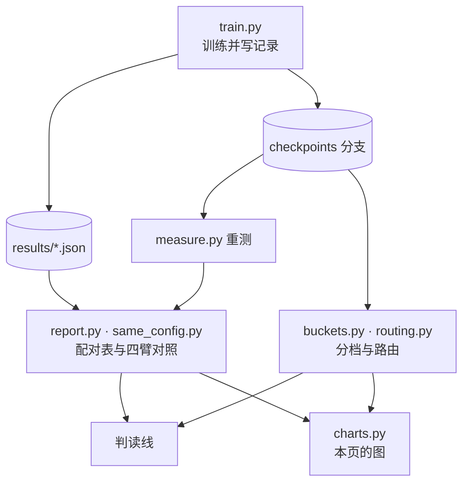

# 实验

仓库里的全部实验都在这一页：数据、协议、流程，以及八轮实验的每一项结果。每个结论都配一张图，图可交互，数字由 `scripts/charts.py` 从 [`results/`](https://github.com/Lfan-ke/ES-MoE/tree/main/results) 现算，与[实验结果](results.md)的表、[判读线](JUDGMENT.md)的判定同源。

<strong>142</strong>次满协议训练

<strong>600</strong>卡时

<strong>8</strong>个主干

<strong>11</strong>次预登记

## 数据集

VisDrone2019-DET：无人机航拍，10 类。训练只用训练集；mAP、面积分档与路由统计都在验证集 548 张上算；测试集只记指纹，不参与评测。

| 划分 | 图片 | 标注框 | 每张平均 | 体积 | 框边长中位数（原图 / 800 像素） |
|:--:|:--:|:--:|:--:|:--:|:--:|
| 训练集 | 6,471 | 343,205 | 53.0 | 1.55 GB | 26.1 / 13.9 |
| 验证集 | 548 | 38,759 | 70.7 | 0.08 GB | 22.8 / 14.1 |
| 测试集 | 1,610 | 75,102 | 46.6 | 0.31 GB | 21.9 / 12.3 |

<figure class="es-fig" id="fig-1">
<figcaption><b>图 1</b>三个划分的规模<em>图片数（左轴）与标注框数（右轴）</em></figcaption>

<small>数据：<code>results/dataset.json</code></small>
</figure>

一张航拍图平均 53 个目标，而且大多很小：按 COCO 面积分档，训练集 34.3 万个框里 20.8 万个小于 32²。协议因此把长边缩到 800 像素，而不是 640。

<figure class="es-fig es-fig--tall" id="fig-2">
<figcaption><b>图 2</b>各类别的标注框<em>按训练集数量排序</em></figcaption>

<small>数据：<code>results/dataset.json</code></small>
</figure>

<figure class="es-fig" id="fig-3">
<figcaption><b>图 3</b>图片分辨率<em>前八种</em></figcaption>

</figure>
<figure class="es-fig" id="fig-4">
<figcaption><b>图 4</b>框边长分布<em>缩放到 800 像素后的占比</em></figcaption>

</figure>

训练集的分辨率从 480×360 到 2000×1500，验证集只有三种。缩放到 800 像素后，三个划分的框边长中位数在 12.3 到 14.1 像素之间。统计由 `scripts/dataset.py` 从数据集压缩包读出；验证集的小、中、大目标数（26,586 / 11,105 / 1,068）与 `results/buckets.md` 的真值一致。

## 训练协议

| 项 | 取值 |
|:--:|:--:|
| 数据 | 全量训练集（`fraction=1.0`），验证集 548 张 |
| 输入 | `imgsz=800` |
| 长度 | 120 epoch，`patience=0` |
| 批大小 | 32 |
| 初始化 | 从零训练 |
| 种子 | 每格三个 seed 起（两格例外，见[口径](#口径)）；同一 seed 的各臂同卡训练、逐 seed 配对 |
| 精度 | 默认混合精度；第八轮全程 FP32（`--amp 0`） |
| 评测 | ultralytics 验证器；同配置对照由 `scripts/measure.py` 从 `last.pt` 的 EMA 权重统一重测 |
| 硬件 | 曦云 C500 105 次、531 卡时；RTX 4090 37 次、69 卡时 |

一次满协议训练在曦云 C500 上要 2.3 到 10.8 小时，处理约 77.7 万张次图片。

<figure class="es-fig" id="fig-5">
<figcaption><b>图 5</b>142 次运行在各主干上的分布<em>运行次数（柱）与卡时（线）</em></figcaption>

<small>数据：<code>results/*.json</code></small>
</figure>

## 实验流程

<figure class="es-fig es-fig--diagram" id="fig-6">
<figcaption><b>图 6</b>一次实验经过的脚本<em>训练、重测、分析、判定</em></figcaption>

</figure>

每一轮开跑之前，先把问题、判据与预测提交进[判读线](JUDGMENT.md)，git 提交时间就是证据；结果出来后再写判定，被推翻的预测保留原文。

## 八轮实验

| 轮 | 问题 | 结论 | 图 |
|:--:|:--:|:--:|:--:|
| 一 | 默认接法与改接在四代主干上是否有效 | v8n、11n 有效，12n、26n 无效 | [9](#fig-9) |
| 二 | 补上 v5n、v9t、v10n，效应怎样随主干变化 | 按主干末端结构分组：SPPF 系为正，注意力末端贴零，E2E 头为负 | [9](#fig-9)、[10](#fig-10) |
| 三 | 上游的 GShard 平衡目标能否解除塌缩 | 设置没有进入训练的模型；五条记录成为重复运行，量出噪声底 | [18](#fig-18) |
| 四 | 读门控的平衡目标能否解除塌缩 | 不能：分派更集中，出现第一个死专家 | [19](#fig-19)、[20](#fig-20) |
| 五 | 输出归一化、跑满专家、四块布局各自的作用 | 输出归一化 +0.0038、跑满专家 +0.0031（v5n，均 3/3）；四块 −0.0071 | [11](#fig-11) |
| 六 | 四块为负来自块数还是辅助损失总量；平衡项防什么 | 差在块数；平衡项防的是专家死掉 | [11](#fig-11)、[20](#fig-20)、[21](#fig-21) |
| 七 | 与 YOLO-Master 同配置对照（默认精度） | 块在两个框架里作用一致，两边加块都有效 | [12](#fig-12)–[17](#fig-17) |
| 八 | 全程 FP32 后是否不变；FP32 噪声底多大 | 差之差仍等效；噪声底 0.0038 / 0.0103 | [13](#fig-13)、[18](#fig-18) |

## 选型

出厂配置在 25% 训练集、640 像素、20 epoch 的预算下选出，再用全量数据与更长的训练复核。完整过程见[选型](SELECTION.md)。

<figure class="es-fig" id="fig-7">
<figcaption><b>图 7</b>候选配置<em>25% 训练集、20 epoch，柱为 seed 0</em></figcaption>

</figure>
<figure class="es-fig" id="fig-8">
<figcaption><b>图 8</b>训练长度与换主干<em>全量训练集，每格三个 seed</em></figcaption>

</figure>

只选一个专家的配置输给基线；4 专家 top-2 在三个 seed 上都为正。换成全量数据后，20、50、100 epoch 与协议的 120 epoch 均值都为正，但不随训练长度单向变化；同样的配置放到 YOLO11n 上 1/3 为正。

## 七代主干

默认接法与改接在 YOLOv5n 至 YOLO26n 七代主干上的逐 seed 配对差，灰带是混合精度噪声底。

<figure class="es-fig" id="fig-9">
<figcaption><b>图 9</b>七代主干的配对差<em>点为 seed，短横为三个 seed 的均值</em></figcaption>

<small>数据：<code>results/summary.md</code></small>
</figure>

默认接法在 SPPF 系末端为正（v5n +0.0055、v8n +0.0025、v9t +0.0025），末端换成注意力块后贴零（v10n −0.0002、11n +0.0013），到 12n、26n 为负。改接在 v5n、v9t、v10n、11n 上低于默认接法，在 12n、26n 上回到持平附近。

<figure class="es-fig" id="fig-10">
<figcaption><b>图 10</b>按目标大小拆开<em>COCO 面积分档的配对差，柱为三个 seed 的均值</em></figcaption>

<small>数据：<code>results/buckets.md</code></small>
</figure>

分档没有一致的尺度利害：v8n 默认接法下大目标三个 seed 都变差（APl −0.0104），改接后翻正；26n 上受损的是小目标（APs −0.0045，0/3）。

<figure class="es-fig es-fig--tall" id="fig-11">
<figcaption><b>图 11</b>对照臂<em>上游块内的设置、四块布局与平衡项，各对同 seed 基线</em></figcaption>

<small>数据：<code>results/summary.md</code></small>
</figure>

输出归一化（+0.0038）与训练期跑满专家（+0.0031）在 v5n 上都是 3/3，跑满专家在 v10n 上持平（+0.0001，1/3）。四块布局在 v10n、v5n 上都是 0/3；把每块权重降到 0.0025、辅助损失总量对齐单块后，v10n 上仍是 −0.0113，差在块数。

## 同配置对照

同一个 `yolo-master-n`、同一份协议，在 YOLO-Master 分支与官方 ultralytics 加本包上各训一遍。每个 seed 的四臂同卡，所有差值都在卡内求。

| 臂 | 框架 | 块 | 训练方式 |
|:--:|:--:|:--:|:--:|
| A | YOLO-Master 分支（`acce839c`） | 四个 `ES_MOE` | 上游训练器 |
| A0 | YOLO-Master 分支 | 无 | 上游训练器 |
| B | 官方 ultralytics 8.4.101 + esmoe | 四个 `ESMoE` | `recipe="upstream"` |
| C | 官方 ultralytics 8.4.101 | 无 | 官方训练器 |

<figure class="es-fig" id="fig-12">
<figcaption><b>图 12</b>四臂逐 seed 的指标<em>第七轮混合精度，第八轮 FP32</em></figcaption>

<small>数据：<code>results/same_config.md</code></small>
</figure>

A − B 比较两个实现；A − A0 与 B − C 是块在各自框架里加了多少；差之差 (A − A0) − (B − C) 是块的作用在两个框架之间差多少，框架自身的差异在这里抵消。

<figure class="es-fig" id="fig-13">
<figcaption><b>图 13</b>四个差与 95% 区间<em>大点为均值，小点为 seed，灰带为噪声底</em></figcaption>

<small>数据：<code>results/same_config.md</code></small>
</figure>

| 精度 | A − B | A − A0 | B − C | 差之差 |
|:--:|:--:|:--:|:--:|:--:|
| 混合精度（第七轮） | −0.0069，无法判定 | +0.0122，有效 | +0.0126，有效 | −0.0004，等效 |
| FP32（第八轮） | +0.0046，无法判定 | +0.0104，有效 | +0.0095，按判读线有效 | +0.0009，等效 |

两轮的差之差都落在等效档：同一个块在两个框架里加出来的量相同。第八轮 B − C 三个 seed 都为正，按页首判读线有效；区间跨零，按噪声底三档记为无法判定。

<figure class="es-fig" id="fig-14">
<figcaption><b>图 14</b>加块后各尺寸目标的变化<em>A − A0 与 B − C 的面积分档</em></figcaption>

<small>数据：<code>results/buckets.md</code></small>
</figure>

两个框架加块后，小目标三个 seed 都为正（APs +0.0049、+0.0080，FP32 下 +0.0086、+0.0069）；大目标涨得最多，但只有 2/3 为正。

<figure class="es-fig" id="fig-15">
<figcaption><b>图 15</b>逐步对拍<em>实线为两个训练器之差，虚线为扰动一层路由之差</em></figcaption>

<small>数据：<code>results/recipe_parity.md</code></small>
</figure>
<figure class="es-fig" id="fig-16">
<figcaption><b>图 16</b>发布模型复核<em>COCO val2017，同一份权重</em></figcaption>

<small>数据：<code>results/release_check.md</code></small>
</figure>

图 15：两个训练器逐步对拍的差，与把同一个训练器的一层路由权重扰动 1e-6 造成的差同一量级，第 4 个 epoch 分别为 0.117 与 0.099，剩下的差来自训练对扰动的放大，不来自实现。图 16：YOLO-Master 发布的权重装进本包的块，在官方 ultralytics 上的四项指标与分支上到小数点后五位一致，参数量同为 2,694,364。

<figure class="es-fig" id="fig-17">
<figcaption><b>图 17</b>每次运行的卡时<em>三个 seed 的平均</em></figcaption>

<small>数据：<code>results/same_config.md</code></small>
</figure>

混合精度下 B 比 A 快；换成 FP32 后两者都约 10.6 小时，耗时差来自精度。

## 重复运行

同一配置、同一 seed、同一张卡跑两遍，mAP50 会差多少？这个差是所有效应的分母，比它小的差别只谈方向。

<figure class="es-fig" id="fig-18">
<figcaption><b>图 18</b>同配置重复运行的差<em>混合精度与 FP32 各五对</em></figcaption>

<small>数据：<code>results/summary.md</code></small>
</figure>

混合精度平均差 0.0045、最大 0.0130；FP32 平均差 0.0038、最大 0.0103，同一量级。第七、八轮的判定线取自这两组数。

## 路由与平衡项

路由统计读每个检查点在验证集上的路由概率：每个专家做 top-1 的比例、进入 top-2 的比例，以及进入 top-2 不足 1% 的死专家。

<figure class="es-fig" id="fig-19">
<figcaption><b>图 19</b>分派集中度与配对差<em>大点为四块布局</em></figcaption>

<small>数据：<code>results/routing.md</code></small>
</figure>

81 个检查点上，主导专家的 top-1 份额与配对 mAP50 差几乎无关（r = +0.044）：分派集中并不让精度变差。

<figure class="es-fig" id="fig-20">
<figcaption><b>图 20</b>各平衡项下的死专家<em>按检查点计</em></figcaption>

</figure>
<figure class="es-fig" id="fig-21">
<figcaption><b>图 21</b>平衡项的梯度<em>同一权重下，各检查点的中位数</em></figcaption>

</figure>

权重 0.01 的 Switch 平衡项下 66 个检查点没有一个出现死专家，每块权重降到 0.0025 的 3 个里有 1 个；去掉平衡项的 6 个全部出现。读门控的目标（上游的 GShard 与论文式 13）对 top-k 之外的专家没有梯度，6 个里 5 个出现死专家。图 21 里读门控的形式与 Switch 同量级，论文式 13 小一到两个数量级，所以死专家不是压力不够。

<figure class="es-fig es-fig--tall" id="fig-22">
<figcaption><b>图 22</b>B 臂逐专家的利用<em>进入 top-2 的比例，红色为死专家</em></figcaption>

<small>数据：<code>results/routing/</code></small>
</figure>

B 臂六个检查点里，前三个块都有专家死掉，只有第四个块四个专家都在工作。

<figure class="es-fig" id="fig-23">
<figcaption><b>图 23</b>路由与目标尺寸<em>528 个相关系数</em></figcaption>

</figure>
<figure class="es-fig" id="fig-24">
<figcaption><b>图 24</b>主导专家的核<em>132 次块分析</em></figcaption>

</figure>

路由没有学到按尺度分工：路由概率与目标尺寸的相关在 −0.49 到 +0.59 之间，283 个为正、245 个为负；主导专家的核四种都出现过。

## 训练开销

<figure class="es-fig es-fig--tall" id="fig-25">
<figcaption><b>图 25</b>加块后的卡时<em>同 seed、同卡的基线为 ×1，橙色为四块布局</em></figcaption>

<small>数据：<code>results/*.json</code></small>
</figure>

七代主干上，单块布局的卡时是基线的 0.97 到 1.10 倍，四块布局更多。

## 口径

- 数字来自 VisDrone2019-DET、从零训练的 nano 量级主干、单机单卡，不是 COCO 数字，也不与 VisDrone 官方榜单比较。
- 三个 seed 不做显著性检验，3/3 全胜时符号检验 p = 0.125。配对差的均值大多落在噪声底之内，结论只写方向。
- 两格不满三个 seed：`yolov5n-e4k2w0.01-rewire` 在 metax3.7 主机上只有 seed 0（同臂在 metax3.3 上有三个 seed），`yolov10n-e4k2w0.01-norm` 只有 seed 0（输出归一化以 v5n 的三个 seed 为准）。两格都不进入均值。
- 面积分档按原图框计，评测时 `maxDets=500`，与训练记录里 `max_det=300` 的指标分开使用。

## 复现

数据集按 `configs/visdrone.yaml` 的布局放好（ModelScope `aiEngineer484/VisDrone`），改其中的 `path`。一个主干的三臂矩阵：

    IMGSZ=800 EPOCHS=120 FRACTION=1.0 ARMS="baseline esmoe rewire" BASE=yolov8n.yaml uv run bash scripts/sweep.sh

其他臂用 `scripts/queue.sh` 排产，任务行格式为 `<base.yaml> <arm> <seed> <tag> [aux_weight]`。训练完成后重算表与图：

    uv run python scripts/report.py
    uv run python scripts/same_config.py
    uv run python scripts/charts.py

检查点、训练参数与逐 epoch 曲线在 [`checkpoints` 分支](https://github.com/Lfan-ke/ES-MoE/tree/checkpoints)。
