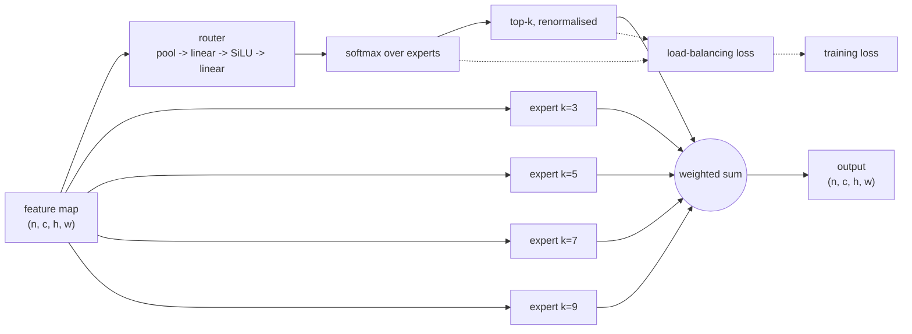

# Tutorial

Install it, add the block to a model, confirm its loss reaches the optimiser, then measure it properly.

    pip install esmoe

## What the block does

The block sends each image to a few of several convolutional experts and sums what they return. Each expert is a depthwise-separable convolution with its own kernel size (3, 5, 7, 9, ...), so the experts differ in receptive field rather than merely in weights. A lightweight router scores them per image, the top-k are kept and renormalised, and the block returns their weighted sum. The block preserves channel count, which is what lets a stock `parse_model` size it.

The auxiliary term is the Switch-Transformer load-balancing loss,

$$
\mathcal{L}_{\text{aux}} = E \sum_{i=1}^{E} \bar{p}_i \cdot f_i ,
$$

where $E$ is the expert count, $\bar{p}_i$ the mean routing probability of expert $i$ over the batch
and $f_i$ the fraction of samples that actually activated it. It is minimised when routing mass and
realised load are spread evenly, which is what keeps the router from collapsing onto one expert.

## The three calls

`inject_esmoe` makes the block nameable in a config, `graft` puts it there and fixes the layer references, `attach_aux_loss` wires the router loss into training. `equip` does all four steps at once: register, graft, build, wire.

    import esmoe

    model = esmoe.equip("yolo11n.yaml", weight=0.01)
    model.train(data="coco8.yaml", epochs=3, imgsz=320)

Take them apart when you need to:

    esmoe.inject_esmoe()
    esmoe.graft("yolov8n.yaml", out="v8-esmoe.yaml", at=[4, 6])
    model = YOLO("v8-esmoe.yaml")
    esmoe.attach_aux_loss(model, weight=0.01)

or from the shell:

    esmoe graft yolo11n.yaml -o yolo11n-esmoe.yaml -e 4 -k 2 --at 4,6

Written by hand, the grafted layer is one line:

    [-1, 1, ESMoE, [4, 2]]   # num_experts, top_k

## What grafting has to get right

A YOLO config addresses earlier layers by absolute index:

    - [[-1, 12], 1, Concat, [1]]

Insert a layer at position 10 and every reference at or past 10 now points one layer too early. The
model still builds, still trains, and is quietly wrong. `graft` therefore renumbers every reference
that sits at or after each insertion point, and a unit test compares the rewritten head against the
original one reference by reference.

Renumbering moves references; it does not retarget them. A head branch that names the old backbone end by index - YOLOv8's P5 lateral `[-1, 9] Concat` does - therefore keeps reading SPPF after the insertion, and the block reaches P5 only through the top-down path. To have the block take over every consumer of the backbone end, pass `rewire=True` (`--rewire` on the CLI):

    esmoe.graft("yolov8n.yaml", out="v8-esmoe.yaml", rewire=True)

It is off by default to keep existing run records comparable. Under one budget (YOLOv8n, imgsz 800, 120 epochs, three seeds) the default wiring gives +0.0025 mAP50 (2/3 wins) with APl −0.0104 (0/3); `rewire` gives +0.0036 mAP50 (3/3 wins) with APl +0.0063 (2/3) - on v8n, bypassing the P5 lateral is where the large-object loss came from. That mechanism does not pin down across generations: on 26n the default wiring consistently loses small objects instead (APs −0.0045, 0/3) and on 12n the direction is unstable; `rewire` pulls 12n and 26n back to parity and trails the default arm only on 11n. Four-generation verdicts: [judgment lines](JUDGMENT.md).

## Proving the auxiliary loss is real

A configuration key named `aux_loss` proves nothing. What proves it:

1. `results.csv` gains an `esmoe_aux` column, non-zero and moving;
2. a unit test asserts `total(with aux) == total(without) + aux * batch_size`;
3. the same test asserts the router receives gradient.

If you want the number yourself in a custom loop:

    aux = esmoe.collect_aux_loss(model)
    (task_loss + 0.01 * aux).backward()

`collect_aux_loss` only sums values published by the latest forward pass, so calling it twice cannot
double-count a stale graph.

## A comparison you can defend

    uv run python scripts/capture_env.py             # freeze versions and hardware into env/
    EPOCHS=20 FRACTION=1.0 SEEDS="0 1 2" bash scripts/sweep.sh
    uv run python scripts/report.py                  # results/summary.md

Each run writes one JSON record: model config, dataset and fraction, hardware, budget, seed,
metrics, artifact path, status, limitation. `report.py` groups arms by backbone, block config *and*
budget, never averaging two different budgets into one row, then prints per-seed paired deltas
against the baseline of the same seed.

Read the paired table, not the two means. Per-arm standard deviations overlap in this kind of
experiment; what carries the claim is that the same seed, same data and same schedule moved in the
same direction three times. On the full VisDrone training set the shipped configuration wins 3/3
seeds by +0.0021 mAP50, and one of those seeds is nearly a tie: a small, consistent effect, not a
reliable per-run improvement. `limitations.md` states the rest.

## Extending

Experts and the balancing objective are plain callables:

    class ThinExpert(nn.Sequential):
        def __init__(self, c1, c2, k):
            super().__init__(nn.Conv2d(c1, c2, k, 1, k // 2, groups=c1), nn.SiLU())

    def entropy_balance(probs, gate):
        return -(probs * probs.clamp_min(1e-9).log()).sum(dim=1).mean()

    block = esmoe.ESMoE(num_experts=3, top_k=2, expert=ThinExpert, balance=entropy_balance)

`esmoe.blocks(model)` iterates every block in a model, which is how the collector and the tests find
them.

## Where the edges are

Channels are inferred on the first forward, a process trains one auxiliary setting at a time, and `loss_items` changed shape across ultralytics releases. Those and the rest are in [Limitations](limitations.md), which is also the page to read before quoting any number.
