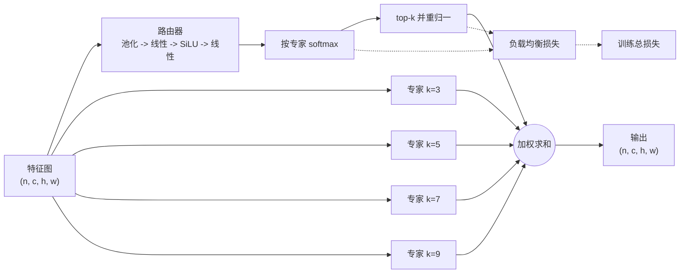

# 教程

装上、把块加进模型、确认它的损失进入优化器，再把效果量准。

    pip install esmoe

## 块做了什么

块把每张图交给若干卷积专家里的少数几个，再把它们的输出加权求和。每个专家是一路深度可分离卷积，核大小各不相同（3、5、7、9……），所以专家之间的差别在**感受野**而不只是权重。由一个轻量路由器按图打分，取 top-k 后重新归一化，块返回它们的加权和。块保持通道数不变，官方 `parse_model` 才能为它定尺寸。

辅助项是 Switch-Transformer 的负载均衡损失：

$$
\mathcal{L}_{\text{aux}} = E \sum_{i=1}^{E} \bar{p}_i \cdot f_i ,
$$

其中 $E$ 是专家数，$\bar{p}_i$ 是专家 $i$ 在该批次上的平均路由概率，$f_i$ 是实际激活它的样本比例。当路由质量与实际负载都摊平时该项最小，这是防止路由坍塌到单个专家的机制。

## 三个调用

`inject_esmoe` 让配置能引用这个块，`graft` 把它放进配置并修好层引用，`attach_aux_loss` 把路由损失接进训练。`equip` 把四件事一次做完：注册、接入、构建模型、接上辅助损失。

    import esmoe

    model = esmoe.equip("yolo11n.yaml", weight=0.01)
    model.train(data="coco8.yaml", epochs=3, imgsz=320)

需要控制细节时拆开：

    esmoe.inject_esmoe()
    esmoe.graft("yolov8n.yaml", out="v8-esmoe.yaml", at=[4, 6])
    model = YOLO("v8-esmoe.yaml")
    esmoe.attach_aux_loss(model, weight=0.01)

或者用命令行：

    esmoe graft yolo11n.yaml -o yolo11n-esmoe.yaml -e 4 -k 2 --at 4,6

手写配置时，接入后的层就是一行：

    [-1, 1, ESMoE, [4, 2]]   # num_experts, top_k

## 接入时必须重编号

YOLO 配置用**绝对层号**引用前面的层：

    - [[-1, 12], 1, Concat, [1]]

在第 10 层的位置插一层，所有大于等于 10 的引用就都往前错了一层。模型照样能建、照样能训，但已经悄悄接错。所以 `graft` 会对每个插入点之后的引用统一重编号，并有单测把改写后的 head 与原 head 逐条引用比对。

重编号只移动引用，不改变引用对象。于是 head 里按序号点名旧主干末层的分支——YOLOv8 的 P5 侧向 `[-1, 9] Concat` 就是——插入之后仍读 SPPF 的输出，块只经自顶向下路径间接影响 P5。要让块接管主干末层的全部下游，加 `rewire=True`（命令行 `--rewire`）：

    esmoe.graft("yolov8n.yaml", out="v8-esmoe.yaml", rewire=True)

默认关闭，为的是与已有实验记录保持可比。同预算对照（YOLOv8n、imgsz 800、120 epoch、三 seed）：默认接法 mAP50 +0.0025（2/3 胜）、大目标 APl −0.0104（0/3）；`rewire` 后 mAP50 +0.0036（3/3 胜）、APl +0.0063（2/3）——在 v8n 上，绕过 P5 侧向正是大目标受损的主要来源。这一机制不随主干代际固定：26n 上默认接法一致受损的是小目标（APs −0.0045，0/3），12n 上方向不稳；`rewire` 在 12n、26n 把默认接法的一致损失拉回持平，仅在 11n 略低于默认接法。四代判定见[判读线](JUDGMENT.md)。

## 怎么证明辅助损失确实生效

配置里有个叫 `aux_loss` 的键什么都证明不了。能证明的是：

1. `results.csv` 里多出 `esmoe_aux` 列，非零且在变化；
2. 单测断言 `总损失(带 aux) == 总损失(不带) + aux × batch_size`；
3. 同一个测试断言路由器确实拿到梯度。

在自定义训练循环里取这个值：

    aux = esmoe.collect_aux_loss(model)
    (task_loss + 0.01 * aux).backward()

`collect_aux_loss` 只汇总最近一次前向发布的值，所以连着调用两次不会把陈旧的计算图重复计入。

## 一次站得住的对照实验

    uv run python scripts/capture_env.py             # 把版本与硬件冻进 env/
    EPOCHS=20 FRACTION=1.0 SEEDS="0 1 2" bash scripts/sweep.sh
    uv run python scripts/report.py                  # results/summary.md

每次实验写一条 JSON 记录：模型配置、数据集与采样比例、硬件、预算、seed、指标、产物路径、状态、局限。`report.py` 按主干、块配置与**预算**三者共同分组，两个不同预算不会被平均进同一行；随后对同 seed 的基线打印逐 seed 的配对差值。

要看的是配对表，不是两组均值。这类实验里两臂的标准差通常重叠；真正撑住结论的是：同一 seed、同一数据、同一 schedule 下，三次都朝同一方向移动。在全量 VisDrone 上，出厂配置以 +0.0021 mAP50 赢下 3/3 seed，但其中一个 seed 几乎打平；这是一个方向一致而幅度很小的效应，单次运行并不可靠。其余边界写在 `limitations.md`。

## 扩展

专家与均衡目标都是普通的 callable：

    class ThinExpert(nn.Sequential):
        def __init__(self, c1, c2, k):
            super().__init__(nn.Conv2d(c1, c2, k, 1, k // 2, groups=c1), nn.SiLU())

    def entropy_balance(probs, gate):
        return -(probs * probs.clamp_min(1e-9).log()).sum(dim=1).mean()

    block = esmoe.ESMoE(num_experts=3, top_k=2, expert=ThinExpert, balance=entropy_balance)

`esmoe.blocks(model)` 遍历模型中的每一个块，汇总器与测试都靠它定位。

### 四个内置的均衡目标

**默认是 Switch**（`switch_balance`），与 0.1.4 和 `results/` 里的全部记录一致：

| 目标 | 公式 | 读什么 |
|:--:|:--:|:--:|
| `switch_balance`（默认） | `E · Σ p̄ᵢfᵢ` | 平均概率 × 实际负载 |
| `gshard_balance` | `N · Σ usageᵢ²` | **门控权重**（上游 `ES_MOE` 用的） |
| `master_balance` | `(1/E) · Σ(μᵢ − 1/E)²` | 门控权重（论文式 13；与上一行只差仿射） |
| `gshard_probs_balance` | `N · Σ usageᵢ²` | 原始概率（用来隔离「读哪个张量」这一个变量） |

差别不在系数而在读什么。平均概率均匀、而 top-k 分派塌到单个专家时——本包七代实测都是这个形态——读概率的两个（`switch`、`gshard_probs`）取到同一个值，分辨不出；读门控的两个（`gshard`、`master`）能分辨。上游代码与论文在这一点上一致，只差一个仿射变换（`L_论文 = (L_上游 − 1)/E²`）。

分辨得出不等于推得动。门控只含 top-k 子集里的分数，读门控的目标对没进 top-k 的专家梯度恒为零：一个专家一旦在所有图上都掉出 top-k，这一项再也够不着它。实测读门控的目标 6 个 checkpoint 里 5 个出现死专家，Switch 在 66 个里一个没有，默认值因此是 Switch（[判读线](JUDGMENT.md)第六轮）。换成上游的目标：

    esmoe.equip("yolo11n.yaml", balance="gshard")

自定义目标也能写进配置：把函数定义在可导入模块的顶层，传给 `equip` 或 `graft`，配置里存的是 `模块:限定名`，训练器与每个 DDP 子进程重建模型时都从这个名字导入回同一个函数。lambda、嵌套函数、`__main__` 里定义的函数按名导入不回来，嫁接时就被拒绝。自定义专家同理（`expert=MyExpert`）。取舍与实测见[已知局限](limitations.md)与[判读线](JUDGMENT.md)。

### 对齐上游的完整配置

上游 `ES_MOE` 与论文和本包默认的差别有四处。四处一起打开才是完整复刻，**都从 `equip` 传进去**：

    model = esmoe.equip(
        "yolo11n.yaml",
        at="backbone_stages",     # 每个 stage 后一块，共四块
        balance="gshard",         # 读门控的平衡项
        out_norm=True,            # 加权求和后的 BatchNorm + SiLU
        dense_training=True,      # 训练期跑满专家
    )

| 项 | 上游 / 论文 | 本包默认 | 打开方式 |
|:--:|:--:|:--:|:--:|
| 平衡项 | `N·Σu²` 读门控 | Switch（`switch_balance`） | `balance="gshard"` |
| 块数 | 主干每 stage 一块，共四块 | 一块（主干末端） | `at="backbone_stages"` |
| 输出归一化 | `BatchNorm + SiLU`（论文式 2 的 `Norm`） | 无 | `out_norm=True` |
| 训练期前向 | 跑满专家，未选的权重为 0 | 跳过未选专家 | `dense_training=True` |
| 推理期剪枝 | `dynamic_threshold=0.4`，剪掉低置信专家、首位无条件保留、余下重归一 | `0.0`（不剪） | `dynamic_threshold=0.4` |
| 推理期稀疏 | `use_sparse_inference=True` | 同 | `sparse_inference=False` 则跑满 |

块本身还对齐了上游的其余参数：`out_channels`（默认与输入同宽）、`top_k=None`（等于用全部专家）、偶数核逐一降为奇数再按 `max_kernel_size` 截断（剪枝过的 checkpoint 才装得回去）、以及 `num_experts` / `reduction` / `dynamic_threshold` / `max_kernel_size` 的取值校验——构造时就报错，不留到训练中途。

后两项默认关着，是为了让 `results/` 里既有的运行仍能原样复现；它们各自的对照实验见[判读线](JUDGMENT.md)。命令行对应 `--at`、`--out-norm`、`--dense-training`。

**这些设置必须走配置文件，不能事后设在块上。** 训练器照 `model.yaml` 重建模型，`YOLO(cfg)` 之后设到块上的东西随那个被丢弃的实例一起消失，不报错也不留痕。`equip` 与 `graft` 把它们写进配置，因此重建多少次都在；`ESMoE.configure(...)` 只适合不经训练器的场合（推理、导出、单元测试）。从任一 checkpoint 读回当时真正生效的设置：`uv run python scripts/blockspec.py`。

## 使用中的边界

通道在首次前向时推断、一个进程一次只训练一种辅助损失设置、`loss_items` 的形态跨版本变过——这些都写在[已知局限](limitations.md)里，引用任何数字之前也先读它。
