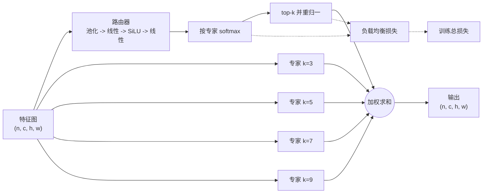

# 教程

本文走完整条路径：安装模块、把它放进官方 YOLO、证明辅助损失确实进入了被优化的损失、再跑一次结论站得住的对照实验。

## 为什么做成插件而不是 fork

ES-MoE 模块来自 [YOLO-Master](https://github.com/Tencent/YOLO-Master)，而该项目的分发包名本身就叫 `ultralytics`。装它等于**顶替**官方库而不是扩展它：同一个 import 路径只能有一个赢家，下游所有工具随之跑在非官方发行版上。手工把模块抠出来也不行 - 上游 `ES_MOE` 依赖一个全局损失注册表、一层 mixture-loss 汇总和 trainer 内的接线，复制单个文件带不走这些。

`esmoe` 走另一条路：独立分发包，依赖 `ultralytics` 而不替换它，只使用公开扩展点，卸载后不留痕迹。

## 安装

    pip install esmoe

## 一张图看懂这个块

每个专家是一路深度可分离卷积，各自带不同的核大小（3、5、7、9……），所以专家之间的差别在**感受野**而不只是权重。轻量路由器按图给专家打分，取 top-k 后重新归一化，块返回它们的加权和。块保持通道数不变，这正是官方 `parse_model` 能为它定尺寸的前提。

辅助项是 Switch-Transformer 的负载均衡损失：

$$
\mathcal{L}_{\text{aux}} = E \sum_{i=1}^{E} \bar{p}_i \cdot f_i ,
$$

其中 $E$ 是专家数，$\bar{p}_i$ 是专家 $i$ 在该批次上的平均路由概率，$f_i$ 是实际激活它的样本比例。当路由质量与实际负载都摊平时该项最小，这是防止路由坍塌到单个专家的机制。

## 五分钟上手

    import esmoe

    model = esmoe.equip("yolo11n.yaml", weight=0.01)
    model.train(data="coco8.yaml", epochs=3, imgsz=320)

`equip` 做四件事：注册 `ESMoE` 让配置能引用它、把它接到主干上、构建模型、把辅助损失接进训练。需要控制细节时可以拆开：

    esmoe.inject_esmoe()
    esmoe.graft("yolov8n.yaml", out="v8-esmoe.yaml", at=[4, 6])
    model = YOLO("v8-esmoe.yaml")
    esmoe.attach_aux_loss(model, weight=0.01)

或者用命令行：

    esmoe graft yolo11n.yaml -o yolo11n-esmoe.yaml -e 4 -k 2 --at 4,6

## 接入时必须做对的一件事

YOLO 配置用**绝对层号**引用前面的层：

    - [[-1, 12], 1, Concat, [1]]

在第 10 层的位置插一层，所有大于等于 10 的引用就都往前错了一层。模型照样能建、照样能训，但已经悄悄接错。所以 `graft` 会对每个插入点之后的引用统一重编号，并有单测把改写后的 head 与原 head 逐条引用比对。

## 怎么证明辅助损失是真的

配置里有个叫 `aux_loss` 的键什么都证明不了。能证明的是：

1. `results.csv` 里多出 `esmoe_aux` 列，非零且在变化；
2. 单测断言 `总损失(带 aux) == 总损失(不带) + aux × batch_size`；
3. 同一个测试断言路由器确实拿到梯度。

如果你在自定义训练循环里要这个值：

    aux = esmoe.collect_aux_loss(model)
    (task_loss + 0.01 * aux).backward()

`collect_aux_loss` 只汇总最近一次前向发布的值，所以连着调用两次不会把陈旧的计算图重复计入。

## 一次站得住的对照实验

    uv run python scripts/capture_env.py             # 把版本与硬件冻进 env/
    EPOCHS=20 FRACTION=1.0 SEEDS="0 1 2" bash scripts/sweep.sh
    uv run python scripts/report.py                  # results/summary.md

每次实验写一条 JSON 记录：模型配置、数据集与采样比例、硬件、预算、seed、指标、产物路径、状态、局限。`report.py` 按主干、块配置**和预算**三者共同分组 - 绝不把两个不同预算平均进同一行 - 然后对同 seed 的基线打印逐 seed 配对差值。

要看的是配对表，不是两个均值。这类实验里两臂的标准差通常重叠；真正撑住结论的是：同一 seed、同一数据、同一 schedule 下，三次都朝同一方向移动。在全量 VisDrone 上，出厂配置以 +0.0021 mAP50 赢下 3/3 seed，而其中一个 seed 几乎是平局 - 这是一个方向一致但幅度很小的效应，不是单次运行可靠的提升。其余边界写在 `limitations.md`。

## 扩展

专家与均衡目标都是普通的 callable：

    class ThinExpert(nn.Sequential):
        def __init__(self, c1, c2, k):
            super().__init__(nn.Conv2d(c1, c2, k, 1, k // 2, groups=c1), nn.SiLU())

    def entropy_balance(probs, gate):
        return -(probs * probs.clamp_min(1e-9).log()).sum(dim=1).mean()

    block = esmoe.ESMoE(num_experts=3, top_k=2, expert=ThinExpert, balance=entropy_balance)

`esmoe.blocks(model)` 遍历模型中的每一个块，汇总器与测试都靠它定位。

## 值得知道的几个坑

- **通道在首次前向时推断。** Ultralytics 在构建模型时就会跑一次前向，所以正常使用中察觉不到；但如果模型在任何前向之前就被 script 或 `state_dict` 加载，此时还没有专家权重可供载入。
- **trainer 会从配置重建模型**，并且 EMA 副本在任何 callback 之前生成。因此 aux 权重除了挂在实例上还存在进程作用域；一个进程一次只训练一种 aux 设置。
- **loss items 的形态跨版本变过** - 8.4.13x 之前是 tensor，之后是具名 dict。两种都已处理；如果你自己 patch 损失，也要两种都处理。
- **在从未调用 `attach_aux_loss` 的进程里重新加载 checkpoint**，训练时不带辅助项。块本身照常运行，只是少了那一项额外损失。
